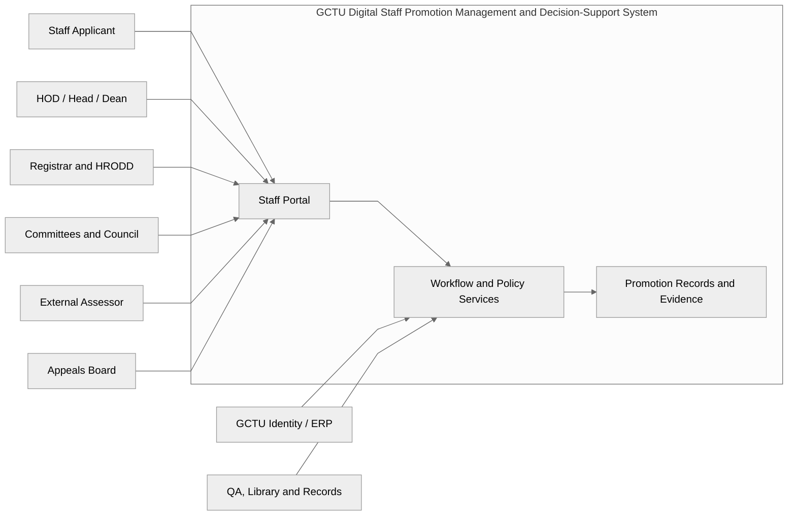
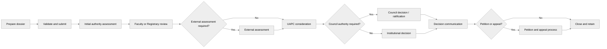
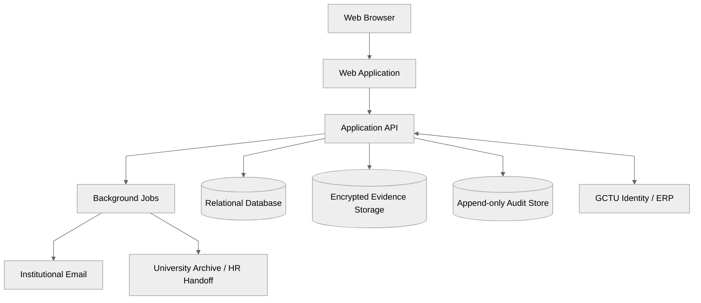

# GCTU Digital Staff Promotion Management and Decision-Support System

## Master Requirements, System Blueprint, and Promotion Route Matrix

**Prepared for:** Benjamin Baidoo and project team

**Institution:** Ghana Communication Technology University (GCTU)

**Baseline date:** 10 August 2026

**Document status:** Master planning baseline for validation and implementation

**System scope:** Academic Senior Members, Administrative and Professional Senior Members, Senior Staff, and Junior Staff

---

## 1. Executive decision

The target product is a **GCTU Digital Staff Promotion Management and Decision-Support System**. It is not only a lecturer-performance portal, a document-upload site, or an automatic scoring application.

The final research supports the following decisions:

1. The system may proceed to implementation of the common institutional foundation and the verified Schedule J and Schedule K routes.
2. Senior Staff and Junior Staff workflow structures may be implemented, but their eligibility and rank rules must remain disabled until HRODD supplies the current controlled Harmonized or Revised Unified Schemes of Service and any GCTU amendments.
3. No user may create a public applicant account. Staff access comes from the authoritative GCTU staff identity source or an HRODD-controlled activation process.
4. Login does not ask the user to select a category or role. The system derives permissions and workspaces from the person's current staff record and effective-dated assignments.
5. A staff member normally starts their own promotion application after login. HRODD may open or announce a promotion cycle, but an invitation is not the only way an eligible staff member can begin.
6. Eligibility calculations, completeness checks, scores, deadlines, and route recommendations are decision support. The responsible GCTU officers and committees retain institutional authority.
7. Appointment, promotion, confirmation, renewal, regrading, upgrading, conversion, and appointment to an office are distinct event types and must not be treated as one workflow.
8. Every case must preserve the policy version, applicant record, evidence set, assessment, committee record, decision, communication, and appeal history that applied to it.
9. Unresolved source conflicts must be represented as controlled policy issues. They must never be hidden in code or resolved by developer assumption.

### 1.1 Research-completeness conclusion

The public research boundary has been reached. The remaining gaps are controlled institutional documents or formal interpretation questions, not ordinary internet-search gaps. Public sources repeatedly confirm that Senior Staff and Junior Staff rules come from sector-wide schemes, but no complete authoritative current GCTU copy was found online.

### 1.2 Evidence labels

| Label | Meaning | System treatment |
|---|---|---|
| `VERIFIED` | Supported by a controlling or official source | May be configured and activated |
| `VERIFIED_CONFLICT` | Official sources disagree | Configure working rule, show conflict, require authorized confirmation |
| `CONFIRMATION_REQUIRED` | Operational detail is incomplete | Do not enforce as a final institutional rule |
| `DESIGN_CONTROL` | Necessary product, security, usability, or governance control | Implement unless GCTU directs otherwise |
| `DISABLED_PENDING_POLICY` | A route exists in principle but its controlling criteria are unavailable | Build structure but block live submission/decision |

---

## 2. Authority and evidence register

### 2.1 Source hierarchy

Where sources differ, use the following order:

1. Ghana Communication Technology University Act, 2020 (Act 1022).
2. GCTU Basic Laws and Statutes, including Schedules J and K.
3. Council-approved Conditions of Service and specific University policies.
4. Official GCTU appointment and promotion forms.
5. Approved administrative manuals, handbooks, and formal directives.
6. Ghana legislation and regulator guidance affecting electronic records, privacy, security, and public-sector records.
7. Product design controls that do not change institutional authority.

The Conditions of Service expressly recognizes the supremacy of the Statutes. A lower source may explain a higher source, but it must not silently override it.

### 2.2 Primary GCTU sources

| ID | Source | Authority/use | Status |
|---|---|---|---|
| SRC-01 | GCTU Act 2020 and Basic Laws/Statutes | Institutional powers, rank and committee framework, Schedules J/K | `VERIFIED` |
| SRC-02 | Conditions of Service for Senior Members, March 2023 | Application rights, timing, effective dates, retirement restriction, petition path | `VERIFIED` |
| SRC-03 | GCTU Administrative Procedures Manual, 2024 | Operational FAPC, RAPC, UAPC and Council routes | `VERIFIED`; some authority wording conflicts with other sources |
| SRC-04 | Heads of Academic Departments Handbook, 2025 | HOD duties, dossier checks, academic routing and timelines | `VERIFIED`; contains an internal authority conflict |
| SRC-05 | GCTU Appeals Board Rules and Regulations, 2023 | Formal appeals, hearings, decisions, and review | `VERIFIED` |
| SRC-06 | GCTU Records and Archives Policy, 2024 | Retention, archive, disposal, and legal-hold controls | `VERIFIED` |
| SRC-07 | Teaching, Research and Service Workload Policy and Guidelines, 2024 | Annual workload evidence and performance context | `VERIFIED_CONFLICT`; not a replacement for Schedule J |
| SRC-08 | Official Forms 1A, 1B, 1C, 2A, 2B, and 3A | Data fields, declarations, attachments, and copies | `VERIFIED_CONFLICT` where form labels/notes differ |
| SRC-09 | User-supplied Academic, Registry, Finance/Audit/Procurement, Library, and Works forms | Detailed profession and dossier requirements | `VERIFIED` against supplied copies |
| SRC-10 | GCTU HRODD page and current staff portal | HRODD responsibility and institutional login pattern | `VERIFIED` |

### 2.3 External legal and design sources

| ID | Source | System implication |
|---|---|---|
| EXT-01 | Ghana Electronic Transactions Act, 2008 (Act 772), section 16 | One reproducible electronic record may satisfy multiple-copy delivery to one addressee, subject to GCTU approval of the electronic process |
| EXT-02 | Ghana Data Protection Act, 2012 (Act 843) and Data Protection Commission guidance | Lawful, purpose-limited, minimal, secure, accountable processing; role-based access; data-subject controls |
| EXT-03 | Public Services Commission functions and scheme references | Promotion procedures and personnel records require controlled, consistent public-service governance |
| EXT-04 | WCAG 2.2 AA design target | Keyboard access, focus, contrast, errors, labels, zoom, responsive layouts, and accessible documents |

---

## 3. Product boundary

### 3.1 In-scope promotion streams

| Stream | Governing baseline | Activation state |
|---|---|---|
| Academic Senior Members | Schedule J | Ready after conflict confirmation and policy configuration |
| Administrative and Professional Senior Members | Schedule K | Ready for verified families after conflict confirmation |
| Senior Staff | Harmonized/Revised Unified Scheme plus local rules | Workflow only; criteria disabled pending controlled policy |
| Junior Staff | Harmonized/Revised Unified Scheme plus local rules | Workflow only; criteria disabled pending controlled policy |

### 3.2 Related events that must remain separate

| Event | Meaning | Treatment |
|---|---|---|
| `PROMOTION` | Movement from one rank to a higher rank under a promotion route | Core scope |
| `UPGRADE` | Movement based on obtaining a required qualification, such as Assistant Lecturer to Lecturer after PhD | Related workflow with its own policy |
| `CONVERSION` | Movement from one staff category or career family to another | Separate policy and approvals |
| `APPOINTMENT` | Entry into a rank, position, or office | Separate workflow |
| `OFFICE_APPOINTMENT` | Appointment to Registrar, Director, HOD, Head of Unit, or similar office | Never inferred as a promotion rank |
| `CONFIRMATION` | Confirmation of an appointment after required service/probation | Separate workflow |
| `RENEWAL` | Renewal of an appointment or contract | Separate workflow |
| `REGRADING` | Change to grade because duties/job evaluation changed | Separate workflow |
| `ACTING_APPOINTMENT` | Temporary exercise of an office | Separate effective-dated assignment |

The first release should focus on `PROMOTION` and the verified academic `UPGRADE`. Other event types can reuse the foundation later without sharing incorrect rules.

### 3.3 Out-of-scope decisions

The system must not:

- automatically award or deny promotion;
- invent unpublished rank ladders or criteria;
- treat a high numerical score as an institutional decision;
- allow technical administrators to make promotion decisions;
- expose raw student comments as promotion evidence;
- reuse an earlier output when a route requires additional new outputs;
- overwrite an original decision when a petition or appeal is filed;
- allow a committee member to assess their own case;
- hard-code the current department/faculty structure;
- make a generic shared HOD, Dean, RAPC, or UAPC login.

---

## 4. Master operating model

### 4.1 Identity and login

1. The login page requests institutional credentials only. It has no public Register action and no role/category selector.
2. Preferred production integration is the existing GCTU staff/ERP identity service or institutional single sign-on.
3. The FYP fallback is an HRODD-imported authoritative staff roster followed by a single-use activation link to the official staff email.
4. An official email alone is insufficient. The identity must match an active staff ID and employment record.
5. Student accounts cannot become staff applicants merely because they use a GCTU domain.
6. A person has one account. Workspaces are derived from effective-dated employment, committee, office, and delegated assignments.
7. A reviewer who is also an applicant may use both workspaces, but conflict and recusal rules block access to or participation in their own decision path.
8. External assessors receive case-specific, expiring, least-privilege links or accounts. They never enter through normal staff registration.
9. Privileged and external access requires stronger authentication, short sessions, and full access logging.

### 4.2 Starting an application

1. HRODD opens or announces an application cycle and activates policy versions.
2. An authenticated staff member selects **Start Promotion Application**.
3. The system derives staff category, current substantive rank, qualifying service date, organizational unit, and candidate next routes.
4. The person chooses only among routes that are valid for that staff record. They do not choose an arbitrary category.
5. The system displays a plain-language readiness result: `Eligible to submit`, `Potentially eligible - review required`, or `Not yet eligible`, with reasons and source clauses.
6. A staff member may draft even when evidence is incomplete. Formal submission is blocked only by mandatory policy and dossier controls.
7. An exceptional, non-standard, or disputed route is sent to HRODD for policy review; it is not silently rejected.
8. Submission creates an immutable dossier snapshot, policy snapshot, applicant snapshot, receipt number, and routed task.
9. The applicant receives email and in-system confirmation immediately.

### 4.3 System context blueprint

---

## 5. Actor and authority matrix

| Actor | Permitted responsibilities | Prohibited authority |
|---|---|---|
| Applicant | Draft, self-check, submit, provide clarification, view status, receive decision, petition/appeal | Score or decide own case; alter submitted snapshot |
| HRODD | Maintain staff/category/rank source data, coordinate promotion operations, configure approved policies, monitor deadlines, support committees | Replace committee/Council decision; change a historic case policy silently |
| HOD | Acknowledge academic case, certify outputs with Library, assess teaching, forward, propose assessors | Participate where below target rank or conflicted |
| Dean/Cognate Dean | Substitute when required, chair/support FAPC, route case | Decide outside delegated statutory authority |
| FAPC | Assess Teaching and Service, deliberate, recommend, keep formal record | Sit with ineligible/conflicted members; make professorial final decision |
| Head/Director | Assess Schedule K ability/human relations, certify professional outputs, forward | Final promotion decision |
| Registrar | Official receipt/correspondence, RAPC/UAPC administration, assessor communication, decision communication | Change committee outcome or use assessor identity outside authorized scope |
| RAPC | Assess/review Administrative and Professional Senior Member case and Service, recommend | Decide beyond approved delegated authority |
| External Assessor | Independent quality and route-specific assessment | Access unrelated records; make final institutional decision |
| UAPC | Final assessment, route decision, or recommendation according to route | Ignore quorum, conflict, or source requirements |
| Council | Final/ratification authority for routes assigned by statute/policy | Delegate invisibly or alter record without formal action |
| Senior Staff A&P Committee | Consider and recommend Senior Staff cases under activated scheme | Apply unapproved/unavailable criteria |
| Junior Staff A&P Committee | Consider and recommend Junior Staff cases under activated scheme | Apply unapproved/unavailable criteria |
| Appeals Board | Hear statutory appeal after internal remedies, issue decision/review | Rewrite original record instead of creating appeal outcome |
| Library/QA | Verify publication metadata and provide authorized aggregate evaluation evidence | Determine promotion outcome |
| Records Officer/Archivist | Apply retention, legal holds, transfer, disposition, destruction certificates | Delete active or held cases |
| System Administrator | Technical configuration, support, availability, backup | View content by default, score, recommend, decide, or erase audit history |

### 5.1 Assignment model

Permissions are granted through effective-dated assignments, not account type alone:

- `StaffEmploymentAssignment`
- `OrganizationalAssignment`
- `OfficeAssignment`
- `CommitteeMembership`
- `CommitteeRoleAssignment`
- `DelegationAssignment`
- `CaseTaskAssignment`
- `ExternalAssessorAssignment`

Each assignment records start date, end date, appointing authority, source document, scope, and status.

---

## 6. End-to-end workflow blueprints

### 6.1 Common lifecycle

### 6.2 Academic Senior Member route

`Applicant -> HOD -> Dean/FAPC -> external assessment where required -> UAPC -> Council where required -> communication/effective date -> petition/appeal -> archive`

Mandatory controls:

- HOD acknowledges and begins assessment.
- HOD and Library verify submitted scholarly outputs.
- HOD assesses Teaching and proposes at least three potential external assessors where required.
- If the HOD is below the target rank, the Dean performs the required substitute role.
- If the Dean is the applicant, a cognate Dean is assigned.
- FAPC excludes the applicant and members below target rank; at least three eligible members including the Dean are required.
- If a lawful FAPC cannot be formed, route directly to UAPC with the reason recorded.
- FAPC assesses Teaching and Service and forwards its recommendation.
- The Registrar manages independent external-assessor correspondence.
- UAPC conducts the final assessment and either decides or recommends to Council according to the route.

### 6.3 Administrative and Professional Senior Member route

`Applicant -> Head/Director -> Registrar intake -> RAPC -> external assessment where required -> UAPC -> Council where required -> communication/effective date -> petition/appeal -> archive`

Mandatory controls:

- Head/Director acknowledges and provides written assessment within the prescribed time.
- The professional unit certifies outputs and proposes at least three assessors where applicable; the Registrar determines assessors for administrative routes.
- RAPC reviews Ability in Work, Promotion of Work, Human Relations, Service, evidence, and route requirements.
- RAPC may communicate that a case will not proceed, with reasons and petition rights.
- UAPC decides or recommends according to the approved route authority.
- Deputy Registrar and approved analogous highest routes proceed to Council under the working 2024 manual rule.

### 6.4 Senior Staff route

`Applicant -> Head of Department/Unit -> Director or Dean or Institute/Centre Director -> Registrar -> Senior Staff A&P Committee -> approved final authority -> communication -> appeal -> archive`

The committee and routing structure are verified. Rank ladders, qualifying service, qualifications, establishment/pool rules, appraisal thresholds, tests/interviews, and final authority remain `DISABLED_PENDING_POLICY`.

### 6.5 Junior Staff route

`Applicant -> Head of Department/Unit -> Director or Dean or Institute/Centre Director -> Registrar -> Junior Staff A&P Committee -> approved final authority -> communication -> appeal -> archive`

The committee and routing structure are verified. Detailed criteria remain `DISABLED_PENDING_POLICY`.

---

## 7. Master Schedule J route matrix

### 7.1 Academic promotion and upgrade routes

| ID | Current rank | Target rank | Minimum service | Output requirement | Minimum area result | External assessment | Working final authority | Target duration | Status |
|---|---|---|---:|---|---|---|---|---:|---|
| J-01 | Assistant Lecturer | Lecturer | Qualification-based | PhD/terminal degree evidence; not a standard publication route | Route-specific qualification review | Not stated as standard route | UAPC working rule | 6 months | `VERIFIED` as upgrade, not ordinary promotion |
| J-02 | Assistant Research Fellow | Research Fellow | Qualification-based | PhD/terminal degree evidence | Route-specific qualification review | Not stated as standard route | UAPC working rule | 6 months | `VERIFIED` as upgrade |
| J-03 | Lecturer | Senior Lecturer | 4 years | 6-10 outputs; at least 6 refereed; submit best 6 | At least Good in Teaching, Promotion of Knowledge, and Service | 1, normally in Ghana but external to GCTU | UAPC | 10 months | `VERIFIED` |
| J-04 | Research Fellow | Senior Research Fellow | 4 years | 8-12 outputs; at least 8 refereed; submit best 8 | At least Good in all 3 areas | 1, normally in Ghana but external to GCTU | UAPC | 10 months | `VERIFIED` |
| J-05 | Senior Lecturer | Associate Professor, Case I | 4 years | 10-15 outputs; at least 10 refereed; submit best 10 | At least Very Good in all 3 areas | At least 2; at least 1 outside Ghana | Council ratification after UAPC | 15 months | `VERIFIED` |
| J-06 | Senior Research Fellow | Associate Professor, Case II | 4 years | 12-16 outputs; at least 12 refereed; submit best 12 | At least Very Good in all 3 areas | At least 2; at least 1 outside Ghana | Council ratification after UAPC | 15 months | `VERIFIED` |
| J-07 | Associate Professor, teaching track | Professor, Case I | 3 years | 15-20 outputs; at least 15 refereed; submit best 15 | At least Excellent in all 3 areas | At least 2; at least 1 outside Ghana | Council after UAPC | 18 months | `VERIFIED` |
| J-08 | Associate Professor, research track | Professor, Case II | 3 years | 20-30 outputs; at least 20 refereed; submit best 20 | At least Excellent in all 3 areas | At least 2; at least 1 outside Ghana | Council after UAPC | 18 months | `VERIFIED` |

### 7.2 Schedule J shared controls

1. Normal application is to the immediate next rank.
2. An application submitted up to two months before qualifying service is due is treated as satisfying the full-duration rule when the qualifying date arrives.
3. A case must not be processed when received less than six months before compulsory retirement unless an authorized policy exception exists.
4. Normal effective dates are 1 February and 1 August.
5. Applicants must receive at least quarterly status information.
6. Where assessor deadlines expire under the applicable policy, the authorized body may use an internal panel; the system must record the trigger and authority.
7. Relevant higher routes require postgraduate supervision evidence; grantsmanship and demonstrated service impact are relevant evidence.
8. Exceptional academic promotion begins through peer nomination for extraordinary scholarly, innovation, or grant-supported impact. It is not an applicant-selected shortcut.
9. A best-N scholarly packet is frozen at submission or at the formally approved replacement point.
10. The system calculates output equivalence but does not determine scholarly quality.

### 7.3 Schedule J assessment bands

| Classification | Score |
|---|---:|
| Excellent | 70-100 |
| Very Good | 65-69 |
| Good | 55-64 |
| Satisfactory | 50-54 |
| Unsatisfactory | Below 50 |

### 7.4 Schedule J areas and calculations

| Area | Core requirements |
|---|---|
| Teaching | 80 institutional/peer/HOD assessment plus 20 authorized aggregate student evaluation |
| Promotion of Knowledge | Output quantity/equivalence, independent quality assessment, contribution, field relevance, and integrity checks |
| Service | Department, faculty, university, profession, industry, community, extension/outreach, leadership, and grantsmanship evidence as applicable |

### 7.5 Scholarly-output equivalence

| Output | Equivalent units |
|---|---:|
| Refereed journal article | 1 |
| Peer-reviewed higher-education book | 3 |
| Peer-reviewed exhibition | 1 |
| Indexed conference proceeding | 1 |
| Non-indexed conference proceeding | 0.5 |
| Deployed technology/product/design | 2 |
| Patented invention | 3 |
| Peer-reviewed book chapter | 1 |
| Non-peer-reviewed book chapter | 0.5 |

Verification must retain DOI, ISSN/ISBN, indexing source/date, journal/publisher information, authorship position and contribution, ORCID/Google Scholar references where supplied, evidence copy, verifier, result, and reason. External identifiers are evidence, not automatic proof of quality.

---

## 8. Master Schedule K route matrix

### 8.1 Shared rank-level requirements

| Tier | Area combination | Professional outputs | Assessment pattern |
|---|---|---|---|
| First progression | Satisfactory in 3 areas and Good in at least 1 core area | 2 accepted memoranda/papers or approved professional outputs | Internal assessment/interview |
| Middle progression | Good in 2 areas and Very Good in 2 areas, including Very Good in at least 1 core area | 5 additional accepted outputs | 1 external assessor, normally Ghana but external to GCTU |
| Highest progression | Very Good in 3 areas and Excellent in at least 1 core area | 5 additional outputs, including at least 2 refereed outputs | Generally 2 external assessors |

The core areas are `Ability in Work/Knowledge in Work` and `Promotion of Work/Application of Knowledge`. Earlier outputs cannot be reused where the next route requires additional outputs.

### 8.2 Registry family

| ID | Current rank | Target rank | Minimum service | Assessment | Working authority | Status |
|---|---|---|---:|---|---|---|
| K-REG-01 | Junior Assistant Registrar | Assistant Registrar | 2 years | Favorable Head assessment; internal/interview | UAPC | `VERIFIED` |
| K-REG-02 | Assistant Registrar | Senior Assistant Registrar | 4 years | Favorable Head assessment; 1 external | UAPC | `VERIFIED` |
| K-REG-03 | Senior Assistant Registrar | Deputy Registrar | 5 years | Favorable Head assessment; 2 external; tenured | Council after UAPC | `VERIFIED` |

### 8.3 Finance and Internal Audit families

| ID | Current rank | Target rank | Minimum service | Assessment | Working authority | Status |
|---|---|---|---:|---|---|---|
| K-FIN-01 | Assistant Accountant / Assistant Internal Auditor | Accountant / Internal Auditor | 2 years | Favorable Head assessment; internal/interview | UAPC | `VERIFIED` |
| K-FIN-02 | Accountant / Internal Auditor | Senior Accountant / Senior Internal Auditor | 4 years | Favorable Head assessment; 1 external | UAPC | `VERIFIED` |
| K-FIN-03 | Senior Accountant / Senior Internal Auditor | Deputy Director, Finance / Deputy Director, Internal Audit | 5 years | Favorable Head assessment; 2 external; tenured | Council after UAPC | `VERIFIED` |

### 8.4 Procurement family

| ID | Current rank | Target rank | Minimum service | Assessment | Working authority | Status |
|---|---|---|---:|---|---|---|
| K-PRO-01 | Junior Assistant Procurement Officer | Assistant Procurement Officer | 2 years | Favorable Head assessment; internal/interview | UAPC | `VERIFIED` |
| K-PRO-02 | Assistant Procurement Officer | Senior Assistant Procurement Officer | 4 years | Favorable Head assessment; 1 external | UAPC | `VERIFIED` |
| K-PRO-03 | Senior Assistant Procurement Officer | Deputy Procurement Officer | Not verified | No promotion route stated in Schedule K | Disabled | `DISABLED_PENDING_POLICY` |

`Head of Procurement` is an office appointment at Deputy Procurement Officer rank, not a verified promotion route. The published appointment process requires advertisement, Council/UAPC action, five years at Senior Assistant level, and two external assessors. It must not be converted into an automatic ladder step.

### 8.5 Works and Physical Development families

| ID | Current rank | Target rank | Minimum service | Assessment | Working authority | Status |
|---|---|---|---:|---|---|---|
| K-WRK-01 | Assistant Architect / Assistant Engineer / Assistant Quantity Surveyor / Junior Assistant Estate Officer | Architect / Engineer / Quantity Surveyor / Assistant Estate Officer | 2 years | Internal/interview | UAPC | `VERIFIED` |
| K-WRK-02 | Professional rank | Senior corresponding professional rank | 4 years | 1 external | UAPC | `VERIFIED` |
| K-WRK-03 | Senior professional rank | Deputy Director, Works and Physical Development or approved analogous rank | 5 years | 2 external; tenured | Council after UAPC | `VERIFIED` |

### 8.6 Information and Communication Technology families

| ID | Current rank | Target rank | Minimum service | Assessment | Working authority | Status |
|---|---|---|---:|---|---|---|
| K-ICT-01 | Assistant Systems Analyst / Assistant Application Technologist / Assistant Network Administrator / Assistant Web Technologist or Programmer | Corresponding professional rank | 2 years | Internal/interview | UAPC | `VERIFIED` |
| K-ICT-02 | Professional rank | Senior corresponding professional rank | 4 years | 1 external | UAPC | `VERIFIED` |
| K-ICT-03 | Senior Systems Analyst or approved analogous senior ICT rank | Deputy Director, ICT | 5 years | 2 external; tenured | Council after UAPC | `VERIFIED` |

### 8.7 Health family

| ID | Current rank | Target rank | Minimum service | Assessment | Working authority | Status |
|---|---|---|---:|---|---|---|
| K-HLT-01 | Medical Officer / Dental Officer / Pharmacist / Optometrist | Senior corresponding rank | 4 years | Favorable Head assessment; 1 external | UAPC | `VERIFIED` |
| K-HLT-02 | Senior corresponding health rank | Principal corresponding rank | 5 years | Specific route says 1 external; general highest-tier rule says 2 | Authority confirmation required | `VERIFIED_CONFLICT` |

### 8.8 Library family

| ID | Current rank | Target rank | Minimum service | Assessment | Working authority | Status |
|---|---|---|---:|---|---|---|
| K-LIB-01 | Junior Assistant Librarian | Assistant Librarian | 2 years | Internal/interview | UAPC | `VERIFIED` |
| K-LIB-02 | Assistant Librarian | Senior Assistant Librarian | 4 years | 1 external | UAPC | `VERIFIED` |
| K-LIB-03 | Senior Assistant Librarian | Deputy Librarian | 5 years | 2 external; tenured | Council after UAPC | `VERIFIED` |

### 8.9 Families not safe to activate

| Family | Finding | Treatment |
|---|---|---|
| Legal | In-House Counsel appointment description exists, but a complete promotion ladder and Ability rubric were not verified | Disable promotion route pending approved mapping |
| Sports | Head appointment description exists, but a complete promotion ladder and Ability rubric were not verified | Disable promotion route pending approved mapping |
| Other analogous professions | The word analogous does not identify rank equivalence by itself | Require HRODD-approved family/rank/route mapping |

### 8.10 Schedule K assessment areas

| Area | Shared rule |
|---|---|
| Ability in Work / Knowledge in Work | Profession-specific 100-point template |
| Promotion of Work / Application of Knowledge | Accepted professional outputs showing policy, management, implementation, innovation, or professional impact |
| Human Relations | Rapport 40, reports 30, prompt service 30 |
| Service | RAPC assessment using approved Appendix A evidence |

One Schedule K sentence refers to five areas, but the detailed structure contains four. Configure four and retain the drafting conflict.

### 8.11 Profession-specific Ability in Work templates

| Profession | Criterion weights totaling 100 |
|---|---|
| Registry | Administrative knowledge 10; logistics/records/minutes/committee/report/follow-up 30; confidentiality 10; initiative 10; supervision 10; independence 10; sustained work 10; appraisal 10 |
| Finance/Audit/Procurement | Current accountancy/finance/MIS 30; financial regulations 5; government directives 5; confidentiality 10; initiative 10; supervision 10; independence 10; timely reports 5; sustained work 5; appraisal 10 |
| Works | Pre-contract/technical/professional 20; post-contract/project/legal 15; timely drawings/reports 10; confidentiality 10; initiative 10; supervision 10; independence 10; sustained work 5; appraisal 10 |
| ICT | General ICT knowledge 25; networking/connectivity/programming/software/specifications 20; confidentiality 10; initiative 10; supervision 10; independence 10; sustained work 5; appraisal 10 |
| Health | Current field knowledge 35; advice to patients 10; confidentiality 10; initiative 10; supervision 10; independence 10; sustained work 5; appraisal 10 |
| Library | Current field knowledge 25; advice to users 10; precision/professionalism 10; initiative 10; library software 20; independence 10; sustained work 5; appraisal 10 |

### 8.12 Schedule K special-circumstances route

A special-circumstances case requires Excellent performance in at least one area for at least five years and at least ten years of relevant experience, followed by UAPC interview. The system must label this route clearly, require supporting reasons and evidence, and prevent it from becoming a general waiver.

---

## 9. Senior Staff and Junior Staff policy boundary

### 9.1 Verified structure

The GCTU Basic Laws and 2024 Administrative Procedures Manual confirm separate Appointments and Promotions Committees for Senior Staff and Junior Staff. The common composition includes the Registrar as chair, relevant Directors, the Librarian, and an appointed secretary, with the candidate's Head/Director attending as required.

Applications route through the Head of Department/Unit, then the relevant Director/Dean/Institute/Centre, and then the Registrar. A standalone Head routes directly to the Registrar.

### 9.2 Missing controlled rule pack

HRODD must provide:

1. Current approved Unified/Harmonized Scheme for Senior Staff.
2. Current approved Unified/Harmonized Scheme for Junior Staff.
3. GCTU amendments, implementation circulars, and effective dates.
4. Complete rank and grade catalog with equivalent ranks.
5. Minimum service by route.
6. Minimum qualification and professional-registration requirements.
7. Appraisal-period and score requirements.
8. Establishment, vacancy, pool, quota, or budget rules.
9. Required tests, interviews, practical assessment, or certificates.
10. Committee recommendation and final-authority rules.
11. Effective-date and backdating rules.
12. Appeal/petition route specific to these categories.

Until this pack is approved and versioned, the product may show career information but must not issue eligibility decisions or accept a live Senior/Junior promotion submission under invented rules.

---

## 10. Dossier and evidence blueprint

### 10.1 Common dossier

- Staff identity, staff ID, official email, contact information.
- Current staff category, substantive rank, grade, appointment type, employment status.
- Department/unit, faculty/directorate, campus, reporting officer.
- Initial appointment date, current-rank effective date, confirmed/tenured status, retirement date where legally usable.
- Target route and target rank.
- Qualification history and certified evidence.
- Employment and promotion history.
- Appraisal history required by the route.
- Declarations of accuracy, authorship, conflict, disciplinary/pending matters where lawfully required.
- Structured evidence with document type, issuer, date, owner, verification status, and source.
- Submission receipt, version, and applicant attestation.

### 10.2 Academic dossier

- Teaching appointments and course history.
- Course level, contact hours, class size, teaching contribution, and period.
- Authorized aggregate student-evaluation summaries, not raw comments.
- Peer/HOD teaching assessment and supporting reports.
- Undergraduate and postgraduate supervision, status, role, completion date, and evidence.
- Research projects, themes, collaborations, grants, funder, amount, role, outcome, and dates.
- Full scholarly-output catalog and route-specific best-N selection.
- DOI, ISSN/ISBN, indexing, peer-review evidence, publisher/journal, publication date, authorship and contribution.
- Technology, patent, exhibition, design, book, chapter, and conference evidence where applicable.
- Department, faculty, university, professional, industry, community, extension and outreach service.
- Proposed assessors where the route requires proposals.

### 10.3 Administrative and Professional dossier

- Profession/job family and current duties.
- Profession-specific Ability in Work evidence.
- Memoranda, policies, reports, manuals, systems, designs, projects, and other professional outputs.
- Accepting Board/Committee, acceptance date, reference, contribution, implementation and impact.
- Output-newness check against earlier promotion cases.
- Human Relations evidence and appraisal reports.
- Service evidence under the approved Appendix A categories.
- Professional registration, continuing development, licences, certifications, and qualifications where required.
- Proposed assessor information for professional units.

### 10.4 Evidence controls

Every item must record `owner`, `category`, `period`, `route use`, `verification state`, `verifier`, `verification date`, `reason`, `source reference`, `confidentiality class`, and `retention class`.

Allowed verification states are `Unverified`, `Pending verification`, `Verified`, `Verified with qualification`, `Rejected`, and `Superseded`. A verifier cannot replace a file invisibly; corrections produce a new version and audit event.

---

## 11. Case lifecycle and status model

### 11.1 Top-level case states

| State | Meaning |
|---|---|
| `PREPARATION` | Applicant is building a dossier |
| `SUBMITTED` | Immutable submission received and initial task created |
| `IN_ASSESSMENT` | HOD/Head, faculty, Registrary, or designated reviewer is assessing |
| `AWAITING_EXTERNAL_ASSESSMENT` | One or more independent reports are outstanding |
| `IN_COMMITTEE_CONSIDERATION` | A formal committee has the case |
| `AWAITING_FINAL_AUTHORITY` | Recommendation awaits UAPC/Council or other approved authority |
| `DECIDED` | Institutional outcome recorded but not necessarily communicated |
| `COMMUNICATED` | Authorized decision notice delivered |
| `UNDER_APPEAL` | Petition, appeal, or review is active |
| `CLOSED` | Process completed and records placed under retention |
| `WITHDRAWN` | Applicant withdrawal accepted under policy |

### 11.2 Applicant-facing statuses

The interface must never show only `Pending`. It must show a meaningful stage, responsible office, last action date, next expected action, and whether applicant action is required.

- Draft.
- Submitted - awaiting HOD/Head acknowledgement.
- Under HOD/Head assessment.
- Under Faculty review.
- Under RAPC review.
- Awaiting external assessor reports.
- Under UAPC consideration.
- Awaiting Council consideration.
- Decision communicated.
- Action required from applicant.
- Petition under review.
- Appeal under review.
- Closed.

### 11.3 Task model

Every stage transition is caused by a task or formal event. A task records owner, office, assignee, start date, due date, dependencies, required output, completion result, escalation rule, delegation, and audit trail.

The workflow engine must support reminders, overdue flags, authorized reassignment, recusal replacement, dependency blocking, pause reasons, and quarterly applicant updates without changing statutory authority.

---

## 12. Policy and decision-support engine

### 12.1 Required policy behavior

1. Store each source as a versioned policy document with title, authority, approval date, effective period, supersession, and source file/hash.
2. Store machine-readable rules separately from source clauses, with a traceable link between each rule and clause.
3. Effective-date every staff category, rank, family, route, criterion, band, workflow, deadline, and authority rule.
4. Freeze the applicable policy version when a case is formally submitted.
5. Explain every eligibility or validation result in plain language and identify the source clause.
6. Distinguish hard blockers, warnings, policy-review items, and informational guidance.
7. Permit authorized policy overrides only with reason, approving authority, and immutable audit entry.
8. Never infer a route from name similarity or the word analogous.
9. Detect reused professional outputs and duplicated evidence references.
10. Calculate qualifying service using approved service-break, leave, secondment, and early-submission rules.
11. Calculate best-N/equivalent scholarly units without making a quality decision.
12. Enforce minimum area classifications as well as totals; an aggregate score cannot compensate where policy requires each area to meet a band.
13. Record conflicts as explicit rule status and prevent activation when the conflict affects legal authority or eligibility.
14. Support controlled policy simulation before activation.
15. Produce a human-readable eligibility report and a machine-readable result.

### 12.2 Result structure

Each rule evaluation returns:

- rule ID and version;
- result: `Pass`, `Fail`, `Warning`, `Not evaluated`, or `Manual review`;
- calculated and required values;
- source clause;
- explanation;
- evidence references;
- evaluator/time;
- approved override, if any.

---

## 13. Committee and external-assessor governance

### 13.1 Committee controls

- Effective-dated committee constitution and membership.
- Chair, secretary, member, attendee, advisor, and observer roles.
- Rank and office eligibility check for each agenda item.
- Quorum calculation at meeting and case level.
- Conflict declaration before access or deliberation.
- Mandatory recusal and replacement workflow.
- Case agenda, papers issued, attendance, deliberation summary, vote or consensus, recommendation, conditions, and dissent where applicable.
- Formal minute approval and signed/authorized outcome record.
- UAPC quorum of half the total membership and mandatory Vice-Chancellor presence, where prescribed.
- No committee result can be recorded from an invalid meeting without a formal exception authority.

### 13.2 External assessor lifecycle

`Proposed -> conflict/eligibility screening -> approved -> invited -> accepted/declined -> evidence released -> report submitted -> report validated -> considered -> closed`

Required controls:

- at least the minimum candidate pool prescribed by route;
- independence, institution, geography, rank/standing, expertise, and conflict checks;
- Registrar-controlled invitation and identity confidentiality;
- route-specific number and geographic distribution;
- case-limited access to the frozen assessment packet;
- confidentiality and data-use declaration;
- deadline, reminder, extension, replacement, and non-response handling;
- structured report plus signed attachment where required;
- report integrity validation and immutable receipt;
- no applicant access to assessor identity where confidentiality rules prohibit it.

---

## 14. Decision, communication, petition, and appeal

### 14.1 Decision record

An institutional decision stores authority, meeting, policy version, outcome, target rank, conditions, effective date, reasons, votes/consensus where recordable, supporting assessments, signatory, communication status, and payroll/HR follow-up.

Allowed outcomes should be policy-configurable, including `Approved`, `Not approved`, `Deferred for specified evidence`, `Returned for correction`, `Withdrawn`, and `Route not established`. The user interface must avoid vague failure language.

### 14.2 Effective dates

Normal Schedule J/K effective dates are 1 February and 1 August. The effective-date service must use the approved qualifying event and authority rule, show its calculation, and permit only an authorized recorded adjustment.

### 14.3 Petition and appeal sequence

Working internal sequence:

1. Petition to UAPC within one month where applicable.
2. Petition to Council within three months where applicable.
3. Appeal to the Appeals Board after internal grievance remedies are exhausted.

The Appeals Board Rules provide:

- filing within one month under Rule 10;
- possible extension within six months for good cause;
- a panel of chair plus two members;
- hearing, testimony, investigation, natural justice, and conflict controls;
- decision within one month after proceedings conclude;
- simple majority and recorded dissent;
- review request within 14 days of written decision;
- full-board review and written decision within 21 days.

The official appeal-form note referring to 14 days for the original appeal conflicts with Rule 10's one month. The working rule is one month because the substantive Appeals Board Rules outrank the form note, but Registrar/Legal must confirm.

An appeal is a linked case with its own evidence, panel, hearings, decision, review, and audit trail. It never overwrites the promotion decision.

---

## 15. Master functional requirements

### 15.1 Identity, staff, and organization

| ID | Requirement | Priority |
|---|---|---|
| IAM-01 | Remove public registration and role/category selection from login | Must |
| IAM-02 | Authenticate through GCTU identity/ERP or HRODD-controlled activation fallback | Must |
| IAM-03 | Match every applicant to active staff ID, official email, and employment record | Must |
| IAM-04 | Support one account with multiple effective-dated workspaces | Must |
| IAM-05 | Enforce MFA/strong controls for privileged and external access | Must |
| IAM-06 | Support secure recovery without creating duplicate identities | Must |
| ORG-01 | Maintain effective-dated faculties, schools, departments, directorates, units, centres, and campuses | Must |
| ORG-02 | Separate person, rank, grade, office, job family, and permission | Must |
| ORG-03 | Import and reconcile authoritative staff/org data | Must |
| ORG-04 | Preserve organizational history for submitted cases | Must |
| ORG-05 | Support delegated/acting appointments with scope and dates | Must |

### 15.2 Policy, route, and lifecycle

| ID | Requirement | Priority |
|---|---|---|
| POL-01 | Version and effective-date all policy documents and executable rules | Must |
| POL-02 | Trace every executable rule to a source clause | Must |
| POL-03 | Freeze policy and applicant snapshots on submission | Must |
| POL-04 | Configure routes rather than hard-code them in interface logic | Must |
| POL-05 | Explain eligibility results and calculations | Must |
| POL-06 | Disable unresolved routes/rules | Must |
| POL-07 | Support controlled simulation, approval, publication, and rollback of policy versions | Must |
| CAS-01 | Allow an authenticated staff member to start a route-derived draft | Must |
| CAS-02 | Support common states plus stream-specific workflow templates | Must |
| CAS-03 | Use actionable applicant-facing statuses instead of generic Pending | Must |
| CAS-04 | Generate immutable receipt and dossier version on submission | Must |
| CAS-05 | Support corrections through controlled requests and new versions | Must |
| CAS-06 | Track tasks, owners, deadlines, reminders, escalations, and reasons for delay | Must |
| CAS-07 | Send quarterly status updates where required | Must |
| CAS-08 | Support withdrawal, deferral, return, and reopening only under approved rules | Must |

### 15.3 Dossier, assessment, and evidence

| ID | Requirement | Priority |
|---|---|---|
| DOS-01 | Capture the full common, Form 2A, and Form 2B dossier as structured data | Must |
| DOS-02 | Maintain document versions, hashes, metadata, verification, and confidentiality class | Must |
| DOS-03 | Support best-N selection and frozen academic assessment packet | Must |
| DOS-04 | Detect reused Schedule K outputs across prior cases | Must |
| DOS-05 | Store authorized aggregate student evaluations without raw comments | Must |
| DOS-06 | Support Library/HOD scholarly-output verification | Must |
| DOS-07 | Support professional-output acceptance and impact evidence | Must |
| ASM-01 | Configure Schedule J bands, areas, equivalencies, and route thresholds | Must |
| ASM-02 | Configure Schedule K shared and profession-specific templates | Must |
| ASM-03 | Preserve criterion score, area score, band, comment, evidence, assessor, and version | Must |
| ASM-04 | Block incomplete mandatory assessments while allowing justified `Not applicable` only where policy permits | Must |
| ASM-05 | Separate system calculation from human quality judgment and institutional decision | Must |
| ASM-06 | Support independent parallel assessments without leaking one assessor's report to another | Must |

### 15.4 Governance and decision

| ID | Requirement | Priority |
|---|---|---|
| GOV-01 | Maintain committees, terms, membership, roles, eligibility, and quorum | Must |
| GOV-02 | Enforce declaration, conflict, recusal, and substitute routing | Must |
| GOV-03 | Support formal agenda, papers, attendance, deliberation, outcome, dissent, and minutes | Must |
| GOV-04 | Enforce route-specific decision authority | Must |
| GOV-05 | Provide case-specific external-assessor nomination, screening, invitation, and reporting | Must |
| GOV-06 | Enforce assessor count, standing, independence, and geographic rules | Must |
| GOV-07 | Record decision reason, authority, effective date, and communication | Must |
| GOV-08 | Generate controlled decision letters and acknowledgement of receipt | Must |
| GOV-09 | Create petition and appeal cases without changing original records | Must |
| GOV-10 | Support Appeals Board panel, hearing, decision, review, and time limits | Must |

### 15.5 Records, reporting, and integration

| ID | Requirement | Priority |
|---|---|---|
| REC-01 | Apply record-class retention from case creation through authorized disposition | Must |
| REC-02 | Retain promotion/regrading/confirmation records for employment plus six years | Must |
| REC-03 | Preserve statutory/major committee papers and minutes permanently in University Archives | Must |
| REC-04 | Support legal hold, archive transfer, disposition approval, and destruction certificate | Must |
| REC-05 | Record immutable security and business audit events | Must |
| RPT-01 | Provide applicant, office, committee, route, aging, bottleneck, and compliance dashboards | Must |
| RPT-02 | Report counts and duration without exposing confidential assessor or applicant data | Must |
| RPT-03 | Export a complete authorized case record and audit report | Must |
| INT-01 | Integrate or reconcile staff identity, employment, rank, and organization with GCTU ERP/HR data | Must |
| INT-02 | Integrate institutional email and notification delivery with delivery status | Must |
| INT-03 | Accept authorized QA/student-evaluation aggregates | Should |
| INT-04 | Support archival export and payroll/HR decision handoff | Should |

---

## 16. Logical system blueprint

### 16.1 Modules

| Module | Responsibility |
|---|---|
| Staff Portal | Accessible applicant/reviewer/committee/records workspaces |
| Identity and Access | Authentication, activation, MFA, permissions, sessions, external access |
| Staff and Organization | Staff master, rank/grade, job family, org units, appointments, history |
| Policy Registry | Source documents, versions, clauses, route/rule configuration and approval |
| Eligibility Service | Explainable route discovery and readiness evaluation |
| Case and Workflow | Case state, tasks, deadlines, routing, delegation, notifications |
| Dossier and Evidence | Structured forms, attachments, versions, validation, verification |
| Assessment | Templates, scoring, bands, independent reports, best-N packets |
| External Assessment | Candidate pool, screening, invitations, restricted workspace, reports |
| Committee Governance | Membership, eligibility, quorum, conflicts, agenda, deliberation, minutes |
| Decision and Effective Date | Authority checks, outcomes, effective-date calculation, letters |
| Petition and Appeals | Internal petitions, Appeals Board case, hearing, decision, review |
| Records and Archive | Retention, legal hold, archival transfer, disposition |
| Notification | Email/in-system notices, reminders, receipts, delivery evidence |
| Reporting and Audit | Operational metrics, compliance reports, immutable event history |
| Integration | GCTU identity/ERP, email, QA/evaluation, storage, archive, HR/payroll handoff |

### 16.2 Deployment blueprint

### 16.3 Architectural rules

- Use a relational database for authoritative structured records and transactions.
- Use protected object storage for evidence, with database metadata and hashes.
- Keep authorization at both function and object/case/stage level.
- Run reminders, file scanning, document generation, exports, and integrations as auditable background jobs.
- Use append-only or tamper-evident audit storage.
- Do not expose direct evidence-storage links; issue short-lived authorized access.
- Keep policy calculation deterministic and testable for a frozen policy version.
- Treat notification delivery as evidence, not as the workflow transaction itself.

---

## 17. Domain and data blueprint

### 17.1 Identity and organization entities

`StaffMember`, `StaffIdentity`, `EmploymentRecord`, `StaffCategory`, `OrganizationalUnit`, `OrganizationalUnitType`, `RankDefinition`, `RankLevel`, `RankHistory`, `JobFamily`, `OfficeDefinition`, `OfficeAppointment`, `Account`, `Permission`, `Assignment`, `Delegation`.

### 17.2 Policy entities

`PolicyDocument`, `PolicyVersion`, `PolicyClause`, `SourceReference`, `PromotionTrack`, `PromotionRoute`, `RouteRequirement`, `AssessmentArea`, `AssessmentTemplate`, `AssessmentCriterion`, `PerformanceBand`, `OutputRule`, `ServicePointRule`, `ExternalAssessorRule`, `WorkflowDefinition`, `TaskDefinition`, `AuthorityRule`, `PolicyConflict`, `PolicyApproval`.

### 17.3 Case and dossier entities

`PromotionCase`, `PolicySnapshot`, `ApplicantSnapshot`, `CaseTask`, `CaseStatusHistory`, `Acknowledgement`, `Declaration`, `Qualification`, `TeachingActivity`, `StudentEvaluationSummary`, `SupervisionActivity`, `ResearchProject`, `ScholarlyOutput`, `ProfessionalOutput`, `AuthorshipContribution`, `GrantActivity`, `ServiceActivity`, `PerformanceAppraisal`, `EvidenceAttachment`, `EvidenceLink`, `EvidenceVerification`, `DossierSnapshot`.

### 17.4 Assessment and governance entities

`AssessmentAssignment`, `AssessmentResponse`, `CriterionScore`, `AreaScore`, `AreaClassification`, `ExternalAssessorCandidate`, `ExternalAssessorAppointment`, `ExternalAssessorRequest`, `ExternalAssessorReport`, `Committee`, `CommitteeTerm`, `CommitteeMembership`, `Meeting`, `MeetingAttendance`, `ConflictDeclaration`, `Recusal`, `AgendaItem`, `CommitteeOutcome`, `VoteRecord`, `MinuteRecord`, `InstitutionalDecision`, `DecisionCommunication`, `AppealCase`, `AppealHearing`, `AppealDecision`, `AuditEvent`.

### 17.5 Records and integration entities

`RetentionClass`, `RetentionAssignment`, `LegalHold`, `ArchiveTransfer`, `DispositionRequest`, `DestructionCertificate`, `IntegrationSystem`, `ExternalReference`, `ImportBatch`, `ReconciliationIssue`, `Notification`, `DeliveryAttempt`, `ExportPackage`.

### 17.6 Key invariants

1. A submitted case references immutable applicant, policy, and dossier snapshots.
2. A case has one active route version at a time.
3. A decision must reference a valid authority event and meeting/outcome where required.
4. An assessor report belongs to one assignment and one frozen packet.
5. A committee member cannot participate while a case conflict/recusal is active.
6. A document replacement creates a new evidence version; it never mutates the submitted binary.
7. A case cannot be physically deleted while active, retained, appealed, audited, or under legal hold.
8. A rank is not an office and an office is not a permission role.
9. Senior/Junior Staff rules cannot become active without an approved policy version.

---

## 18. Access-control matrix

Legend: `O` own case, `T` assigned task/case, `M` formal meeting scope, `A` authorized administration, `-` no access.

| Function | Applicant | HOD/Head | Dean/FAPC/RAPC | Registrar/HRODD | External | UAPC/Council | Appeals | Records | Sys Admin |
|---|---:|---:|---:|---:|---:|---:|---:|---:|---:|
| View staff master | O | T | T | A | - | T | T | A | Metadata only |
| Edit staff master | - | - | - | A | - | - | - | - | - |
| Draft dossier | O | - | - | Support by permission | - | - | - | - | - |
| View submitted dossier | O | T | T/M | T/A | T restricted | T/M | T | A | Break-glass only |
| Verify evidence | - | T | T | T/A | T report only | T | T | A records only | - |
| Score/assess | - | T | T/M | Assigned only | T | T/M | Appeal scope | - | - |
| Configure policy | - | - | - | A with approval | - | Approve where assigned | - | - | Technical deploy only |
| Record committee outcome | - | - | M | Secretary role | - | M | M | - | - |
| Record final decision | - | - | - | Secretary/admin support | - | Authorized authority | Appeals authority | - | - |
| View assessor identity | - | Restricted | Restricted | A | Own identity | Restricted | As authorized | Restricted | - |
| Export case | Own package | T | M | A | Own report | M | Appeal case | A | Break-glass only |
| Delete/dispose record | - | - | - | - | - | - | - | A after approval | - |

All content access, downloads, exports, impersonation/support access, policy changes, decisions, and disposition actions must be audited.

---

## 19. Non-functional, legal, and quality requirements

### 19.1 Security and privacy

- Least privilege and deny-by-default object authorization.
- MFA for privileged users and external assessors.
- Encryption in transit and at rest, including backups.
- Malware scanning, MIME/signature validation, size limits, and quarantining of uploads.
- Protection against insecure direct object references, mass assignment, injection, cross-site scripting, request forgery, brute force, and session fixation.
- Short-lived external links and no indexable evidence URLs.
- Separation of production, test, and development data; no real promotion dossier in development.
- Privacy notice, lawful-purpose register, data minimization, role-based redaction, and subject-access process.
- No solely automated promotion decision or opaque AI scoring.
- AI assistance, if introduced later, must be optional, disclosed, reviewable, and prohibited from final ranking/decision.
- Backup, recovery, security incident, breach, and business-continuity procedures.

### 19.2 Records and retention

- Promotion/regrading/confirmation/justification/supporting records: end of employment plus six years, then authorized disposition.
- Statutory and major committee agendas, minutes, and papers: permanent archival retention.
- Committee membership and interest records: term/tenure plus six years.
- Core digital staff record: permanent.
- Legal hold overrides ordinary disposition.
- Every destruction requires authorization and a destruction certificate.
- Closing a case does not mean deleting it.

### 19.3 Usability and accessibility

- First screen after login is the user's work dashboard, not a marketing page.
- Applicant dashboard shows readiness, missing evidence, exact current stage, next action, owner, and date.
- Forms use short sections, progressive disclosure, autosave, clear examples, and inline validation.
- Reviewers receive a case summary, route requirements, evidence map, conflicts, deadlines, and decision controls in one coherent workspace.
- Use plain terms; explain policy wording in help text without changing legal meaning.
- Meet WCAG 2.2 AA target for keyboard, focus, labels, error identification, contrast, zoom/reflow, and screen-reader structure.
- Support current desktop and mobile browsers, but optimize evidence review and committee work for desktop/tablet.
- Produce accessible PDF/Word exports with headings, tables, captions, page numbers, and readable monochrome printing.

### 19.4 Reliability and performance

- No successful submission without a durable receipt and snapshot.
- Transactional workflow changes and idempotent background jobs.
- Recoverable file uploads and resumable handling for permitted large files.
- Availability, response time, storage, concurrency, recovery-time, and recovery-point targets must be approved by GCTU ICT before production.
- Health monitoring, structured logs, error tracing, and administrator alerts without exposing dossier content.

---

## 20. Reporting and analytics

### 20.1 Operational reports

- Cases by stream, route, stage, office, and cycle.
- Tasks due, overdue, reassigned, paused, or awaiting applicant action.
- External assessor acceptance, response time, replacement, and overdue rate.
- Committee agenda readiness, quorum risk, and outstanding minutes.
- Decision communication and effective-date handoff status.
- Petition/appeal age and deadline risk.

### 20.2 Management and compliance reports

- Median/percentile time by route and stage.
- Bottleneck and workload analysis by office, never public individual blame metrics.
- Outcome counts by staff category and route with privacy thresholds.
- Policy exceptions, overrides, conflicts, and unresolved route attempts.
- Evidence-verification completion and integrity exceptions.
- Access, download, export, decision, policy-change, and retention audit reports.
- Quarterly applicant-update compliance.

Reports must suppress or aggregate sensitive information, assessor identities, raw comments, health data, and small-group data that could identify individuals.

---

## 21. Master conflict and clarification register

| ID | Issue | Working treatment | Required owner/action | Blocks common build? | Blocks route activation? |
|---|---|---|---|---:|---:|
| CL-01 | HOD Handbook contains conflicting statements on FAPC/UAPC/Council authority for academic promotions | Use detailed Basic Laws and 2024 Manual: UAPC ordinary; Council professorial | Registrar/Legal written confirmation | No | Yes for final authority configuration |
| CL-02 | Basic Laws committee-function wording and 2024 Manual differ on Schedule K final authority | Use 2024 Manual: UAPC ordinary; Council Deputy Registrar/analogous | Registrar/Legal confirmation | No | Yes |
| CL-03 | Health Principal route says 1 external while highest-tier general rule says 2 | Keep route disabled or require 2 conservatively until interpretation | Registrar/RAPC/Legal | No | Health highest route only |
| CL-04 | Form 1A is titled promotion but body is appointment-oriented | Do not use as promotion master form | HRODD/Registrar identify intended use | No | No |
| CL-05 | Form 2A and 2B require different physical copy counts | Use one reproducible electronic packet only after institutional approval | Registrar/Legal/ICT approve electronic operating rule | No | Production paperless launch |
| CL-06 | Schedule K refers once to five areas but defines four | Configure four areas | Registrar/RAPC confirm drafting interpretation | No | Low risk |
| CL-07 | Procurement has no verified route from Senior Assistant to Deputy | Do not invent; treat Head as office appointment | HRODD provides approved route if one exists | No | Procurement highest route |
| CL-08 | Legal and Sports lack complete promotion ladders/rubrics | Disable | HRODD supplies approved mappings/templates | No | Those families |
| CL-09 | Current Senior Staff and Junior Staff schemes are controlled/unavailable | Build workflow only; disable rules | HRODD supplies full current schemes and amendments | No | Both streams |
| CL-10 | Current organizational pages show inconsistent/reorganized department names | Never hard-code; import effective-dated org master | HRODD supplies authoritative org/rank/staff dataset | No | Production data migration |
| CL-11 | Electronic signature, certified-copy, and official letter requirements are not fully specified | Support audit-backed approval and generated documents; do not claim legal signature equivalence yet | Registrar/Legal/ICT approve | No | Fully paperless launch |
| CL-12 | Student-evaluation source/interface and authorized aggregate format are unspecified | Store aggregate only; no raw comments | QA/ICT define feed/report and access rules | No | Automated teaching evidence |
| CL-13 | Workload policy has inconsistent annual publication expectations | Use as annual evidence only; Schedule J controls promotion | Academic Board/QA clarify workload scorecard | No | No |
| CL-14 | Appeal form says 14 days; Appeals Rules say one month | Use one month working rule | Registrar/Legal confirm and correct form/process | No | Appeal deadline activation |
| CL-15 | Non-standard/skipped-rank requests and exceptional cases need exact intake authority | Route to manual policy review; never auto-reject/approve | HRODD/Registrar define exception protocol | No | Exception route |
| CL-16 | Breaks in service, leave, secondment, and acting time calculations need detailed local rules | Manual review with visible calculation until supplied | HRODD supplies calculation rules | No | Affected eligibility cases |
| CL-17 | Senior/Junior establishment, vacancy, pool, quota, and budget conditions are unknown | No eligibility decision | HRODD/Finance provide rules | No | Senior/Junior streams |
| CL-18 | Exact production integration contract with ERP/staff portal is unknown | Use import adapter in FYP; keep identity boundary replaceable | GCTU ICT supplies API/SSO contract | No | Production integration |

No conflict may be marked resolved without the answer, authority, source, effective date, approver, and affected policy version.

---

## 22. Acceptance scenarios

The following scenarios define a credible minimum system:

1. **Role-free login:** Benjamin Baidoo signs in once and sees only workspaces derived from his staff and committee assignments.
2. **No public registration:** A student with an official institutional email cannot create a staff-applicant account.
3. **Academic route discovery:** A Lecturer sees Senior Lecturer readiness, four-year service calculation, best-six requirement, area thresholds, and cited reasons.
4. **Academic submission:** Form 2A-equivalent dossier submits as an immutable snapshot with receipt and HOD task.
5. **Best-N control:** The system calculates equivalence, freezes the best-N packet, and retains excluded outputs without sending them as selected work.
6. **Research-track difference:** Senior Research Fellow and Professor Case II use their distinct output thresholds.
7. **HOD substitution:** An HOD below target rank is replaced by the Dean for the required assessment.
8. **Dean conflict:** A Dean applicant routes to a cognate Dean and cannot access committee action on the case.
9. **FAPC eligibility:** Members below target rank or conflicted are excluded; an invalid composition routes under the approved exception.
10. **Schedule K profession rubric:** Registry and Works cases load different 100-point Ability templates while sharing the other areas.
11. **No output reuse:** A prior Schedule K output cannot satisfy a later route's additional-output requirement.
12. **Procurement boundary:** Senior Assistant Procurement Officer is not offered an invented Deputy promotion route.
13. **External assessment:** Required assessor count, geography, standing, conflicts, deadlines, and restricted evidence access are enforced.
14. **Committee governance:** A recommendation cannot be finalized without valid membership, quorum, conflict declarations, and a recorded outcome.
15. **Authority route:** Ordinary and professorial academic cases proceed to the correct configured final authority.
16. **Meaningful status:** Applicant sees `Awaiting external assessor reports`, owner, last action, and next expected action instead of `Pending`.
17. **Decision communication:** Approved/not-approved decision, reasons, effective date, signatory, delivery and acknowledgement are preserved.
18. **Appeal separation:** A petition/appeal creates a linked case and leaves the original decision immutable.
19. **Policy versioning:** A new policy does not recalculate a submitted case unless an authorized transition rule explicitly applies.
20. **Senior/Junior safety:** Their workflow is visible, but eligibility/submission remains blocked until an approved scheme is activated.
21. **Records safety:** A system administrator cannot permanently delete a closed case; disposition requires records authority and retention expiry.
22. **Audit reconstruction:** An authorized auditor can reconstruct who viewed, changed, assessed, routed, decided, communicated, exported, and disposed of every case record.
23. **Accessibility:** The complete applicant and reviewer workflows work by keyboard at 200 percent zoom without clipped text or hidden errors.
24. **Recovery:** A failed notification or background job retries without duplicating a submission, assessment, or decision.

---

## 23. Implementation roadmap and gates

### Gate 0: Baseline validation

- Project team and supervisor review this master baseline.
- Registrar/Legal, HRODD, academic leadership, RAPC representatives, Records, QA, and ICT review their clarification items.
- Decisions are signed or recorded with authority and effective date.

### Phase 1: Institutional foundation

- Identity/activation and no-public-registration model.
- Staff, category, rank, grade, office, job family, and effective-dated organization.
- Permission, assignment, delegation, conflict and audit foundation.
- Policy source/version/clause registry.

**Gate 1:** Identity and organization imports reconcile; no role/category selector; access tests pass.

### Phase 2: Case, dossier, and evidence

- Route discovery, application start, common case lifecycle and task engine.
- Structured Form 2A/2B dossiers and profession-specific evidence.
- File security, versioning, verification, snapshots, receipts, and meaningful statuses.

**Gate 2:** Academic and Schedule K submissions reproduce the required official dossier without data loss.

### Phase 3: Policy and assessment

- Schedule J route/eligibility, equivalence, best-N, bands and assessment.
- Schedule K families, output-newness, profession rubrics, bands and assessment.
- Explainable rule results and manual-review path.

**Gate 3:** Every active rule traces to a clause and passes route-boundary tests.

### Phase 4: Workflow and external assessment

- HOD/Dean/FAPC and Head/Registrar/RAPC workflows.
- External assessor candidate, screening, invitation, secure workspace and report.
- Deadline, reminder, escalation, substitution and quarterly updates.

**Gate 4:** End-to-end academic and professional cases pass with conflict and overdue scenarios.

### Phase 5: Governance, decision, and appeal

- Committee terms, membership, eligibility, quorum, agenda and minutes.
- UAPC/Council authority, decision letters, effective dates and handoff.
- Petition, Appeals Board, review, records and archive.

**Gate 5:** An auditor can reconstruct a complete decision and appeal with no unauthorized action.

### Phase 6: Senior/Junior policy activation and production hardening

- Import approved controlled schemes.
- Configure and validate rank ladders, criteria, establishment/pool and authority.
- Complete SSO/ERP, email, QA, archive and HR/payroll integrations.
- Security, privacy, accessibility, performance, recovery, UAT and deployment review.

**Gate 6:** No stream enters production until its policy owner signs the configured route matrix and acceptance evidence.

---

## 24. Definition of done

The full system is complete only when:

1. All four staff streams are represented, and only approved routes are active.
2. Every active policy rule is versioned, effective-dated, source-linked, explainable, and tested.
3. Login and account activation rely on authoritative staff identity with no public registration or role selector.
4. Schedule J and verified Schedule K route boundaries, dossiers, assessments, external reports, committees, decisions and appeals work end to end.
5. Senior/Junior schemes have been supplied, configured, validated and formally approved before activation.
6. Committee membership, rank eligibility, quorum, conflicts, recusals, outcomes and minutes are enforceable and auditable.
7. Applicant status is clear enough that ordinary users do not need to ask where their case is or what to do next.
8. Records, privacy, security, retention, legal hold, archive and disposition controls are verified.
9. Accessibility, mobile/desktop layout, document readability, recovery and performance tests pass.
10. GCTU stakeholders complete UAT and sign the route matrix, policy configuration and operating procedures.

---

## 25. Final readiness statement

The research is sufficient to begin a professional implementation of the common platform and the verified Academic Senior Member and Administrative/Professional Senior Member promotion streams. The design must preserve controlled policy configuration because several official sources conflict and because Senior/Junior Staff schemes are not publicly available.

The correct professional response is therefore neither to delay the entire system nor to guess the missing rules. Build the shared institutional platform, activate only source-supported routes, keep unresolved policies visibly disabled, and obtain formal GCTU confirmation before each affected route enters live use.

---

## 26. Official source links

- GCTU Basic Laws and Statutes: https://site.gctu.edu.gh/gctu-basic-laws
- GCTU Staff Appointment and Promotion Forms: https://site.gctu.edu.gh/staff-appointment-and-promotion-forms
- Conditions of Service for Senior Members: https://site.gctu.edu.gh/wp-content/uploads/gtuc/external/policies/CONDITIONS-OF-SERVICE-FOR-SENIOR-MEMBERS.pdf
- GCTU Administrative Procedures Manual, 2024: https://site.gctu.edu.gh/wp-content/uploads/gtuc/external/Administrative-Procedures-Manual.pdf
- Heads of Academic Departments Handbook, 2025: https://site.gctu.edu.gh/heads-of-academic-departments-handbook
- Appeals Board Rules and Regulations, 2023: https://site.gctu.edu.gh/wp-content/uploads/gtuc/external/policies/Appeals-Board-Rules-and-Regulations.pdf
- GCTU Records and Archives Policy, 2024: https://site.gctu.edu.gh/wp-content/uploads/gtuc/external/Records-and-Archieves-Policy-Final-Accepted.pdf
- Teaching, Research and Service Workload Policy: https://site.gctu.edu.gh/wp-content/uploads/gtuc/external/Teaching-Research-and-Service-Workload-Policy-and-Guidelines.pdf
- GCTU Regulations and Policies: https://site.gctu.edu.gh/regulations-and-policies
- GCTU HRODD: https://site.gctu.edu.gh/human-resource-and-organisational-development
- GCTU ERP Staff Portal: https://erp.gctu.edu.gh/
- GCTU Online Evaluation of Teaching and Courses: https://site.gctu.edu.gh/online-evaluation-of-teaching-and-courses
- Ghana Electronic Transactions Act, 2008: https://orc.gov.gh/legislation/Electronic_Transactions_Act_no_772_2008.pdf
- Ghana Data Protection Commission compliance guidance: https://dataprotection.org.gh/compliance/
- Ghana Data Protection Act, 2012: https://dataprotection.org.gh/wp-content/uploads/2025/05/Data-Protection-Act-2012-Act-843.pdf
- Public Services Commission approved schemes page: https://psc.gov.gh/list-of-approved-schemes-of-service/
