# CHAPTER FOUR: SYSTEM DESIGN AND IMPLEMENTATION

## 4.1 Introduction

This chapter presents the design and implementation of the Digital Staff Promotion Support System for Ghana Communication Technology University (GCTU). It covers the system architecture, database design, workflow and decision-support design, role-based access control, the technology stack, the implemented system modules, the user interface, testing carried out on the working system, and the deployment configuration.

Every diagram, code snippet, and screenshot in this chapter is drawn directly from the implemented and verified system — the prototype described in Chapter 3 has been built, its scoring logic corrected during implementation (see §4.7.2), and its full workflow (lecturer submission → HOD review → HR verification → committee recommendation → HR final decision) has been exercised end-to-end in a live browser session, not merely inspected in source code.

## 4.2 System Architecture

The system follows the three-tier architecture proposed in Chapter 3: a presentation layer, an application layer, and a data layer, implemented as a single Next.js application with a PostgreSQL (Neon) database accessed through Prisma ORM.

**Figure 4.1 — System Architecture**

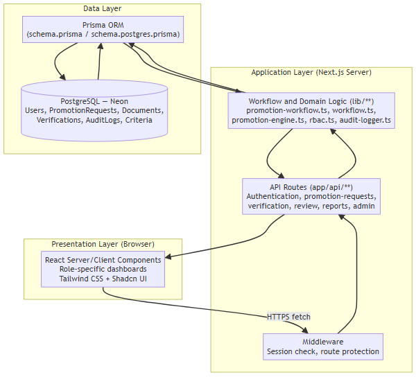

<details>
<summary>Diagram source (Mermaid)</summary>

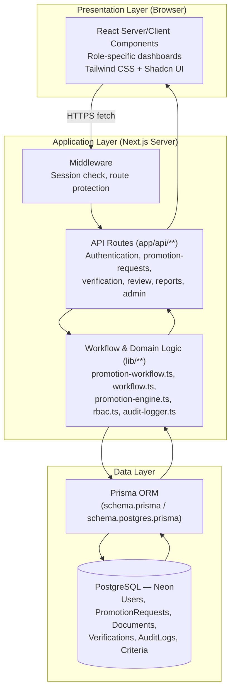

</details>

- **Presentation layer** — role-specific dashboards (Lecturer, HOD/Dean, HR Admin, Committee Reviewer, System Admin), each rendered from shared layout components (`AppShell.tsx`, `BottomNavigation.tsx`) so navigation adapts automatically between a desktop sidebar and a mobile bottom tab bar.
- **Application layer** — Next.js API routes under `app/api/` handle authentication, promotion-request lifecycle, document verification, committee review, and reporting. Business rules (status transitions, eligibility calculation, audit logging) are isolated in `lib/`, not scattered across route handlers, so the same rules apply regardless of which route calls them.
- **Data layer** — Prisma ORM maps the domain model to PostgreSQL hosted on Neon. Two schema files exist (`schema.prisma` for local development, `schema.postgres.prisma` for the deployed Postgres target); the correct one is selected automatically at build time by `scripts/prisma-generate.js` based on the `VERCEL` / `NODE_ENV` environment.

## 4.3 Database Design

The database is relational, modelled with Prisma. The diagram below shows the core promotion-workflow entities (auxiliary tables such as legacy `Lecturer`/`AdminAccount` compatibility records and `SystemSetting` key-value configuration are omitted for clarity).

**Figure 4.2 — Entity Relationship Diagram**

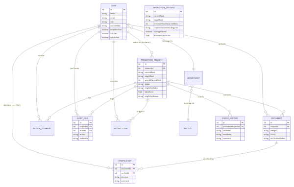

<details>
<summary>Diagram source (Mermaid)</summary>

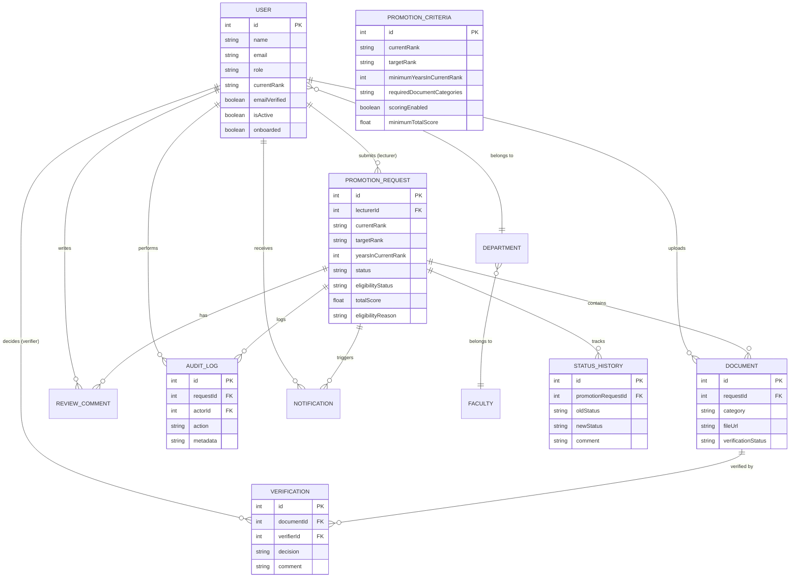

</details>

Key design points:

- **`PromotionRequest`** is the aggregate root of the workflow — it carries `status` (the workflow stage, e.g. `UNDER_HR_VERIFICATION`), `eligibilityStatus` and `totalScore` (the decision-support outcome, computed — never entered directly by a user).
- **`Document`** and **`Verification`** are separate entities, matching the design in Chapter 3 exactly: a `Document` caches its current `verificationStatus` for fast display, while every individual verify/reject decision is additionally recorded as its own `Verification` row (verifier, decision, comment, timestamp) for a complete audit trail. Every document a lecturer uploads must belong to one of the university's evidence categories (`TEACHING`, `RESEARCH`, `SERVICE`, `QUALIFICATIONS`, `PUBLICATIONS`, `PROFESSIONAL_DEVELOPMENT`, `OTHER_SUPPORTING_EVIDENCE`).
- **`AuditLog`** and **`StatusHistory`** are append-only: every verification decision, status change, and eligibility calculation writes a record, which is what makes the Status History panel shown in Figure 4.10 possible.
- **`PromotionCriteria`** externalises the promotion rules (required years in rank, required evidence categories, minimum score) per rank transition, so criteria can be reconfigured by a System Administrator without a code change.

## 4.4 Promotion Workflow State Design

The `PromotionRequest.status` field is a finite state machine. Valid transitions are enforced centrally in `lib/workflow.ts` — a request can only move to a new status if that transition is both a legal state-machine edge *and* permitted for the acting user's role, so a Committee Reviewer, for example, cannot move a request into `UNDER_HR_VERIFICATION`.

**Figure 4.3 — Promotion Workflow State Diagram**


<details>
<summary>Diagram source (Mermaid)</summary>

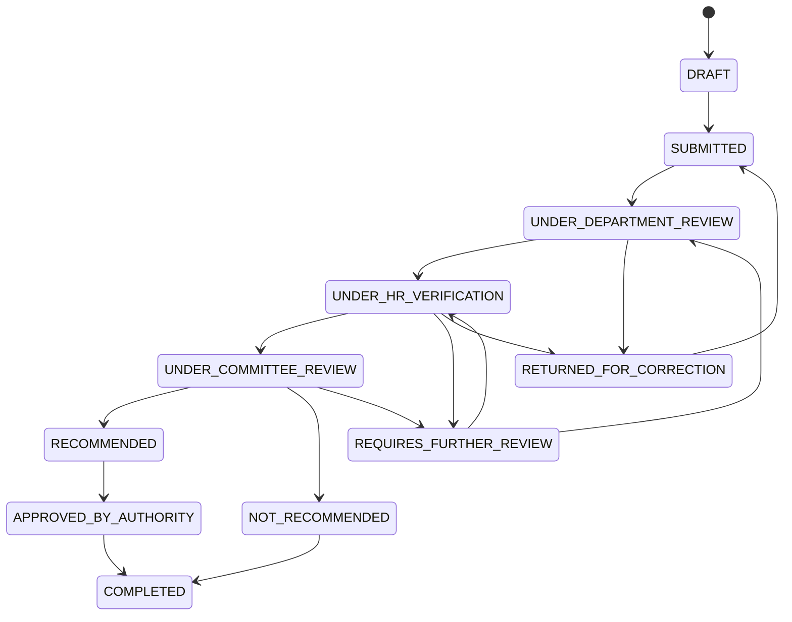

</details>

*(`UNDER_HR_VERIFICATION → UNDER_COMMITTEE_REVIEW` occurs when all required evidence categories are verified and the computed score meets the configured threshold; otherwise the request routes to `REQUIRES_FURTHER_REVIEW`.)*

## 4.5 Use Case Diagram

**Figure 4.4 — Use Case Diagram**

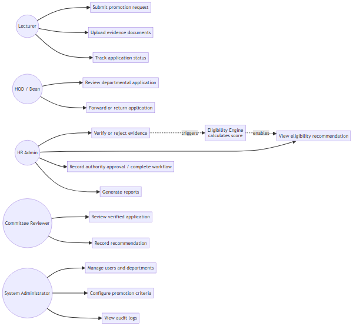

<details>
<summary>Diagram source (Mermaid)</summary>

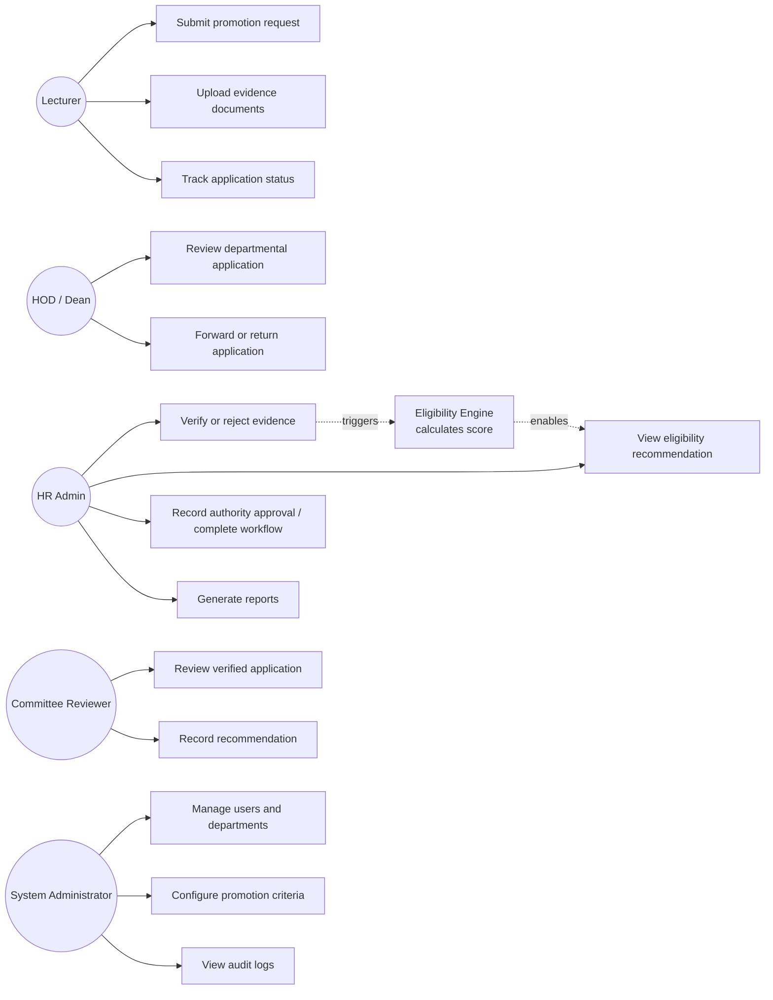

</details>

## 4.6 Role-Based Access Control Implementation

Every state-changing action passes through a single authorisation check before touching the database. `assertActorRole` (used throughout `lib/promotion-workflow.ts`) rejects the operation before any write occurs if the acting user's role is not permitted:

```typescript
// lib/promotion-workflow.ts
export async function recordCommitteeReview(
  client: DbClient,
  input: { actor: WorkflowActor; requestId: number; comment: string; recommendation?: ReviewRecommendation | null }
) {
  assertActorRole(input.actor, ['COMMITTEE_REVIEWER', 'SYSTEM_ADMIN']);

  const current = await client.promotionRequest.findUnique({ where: { id: input.requestId } });
  if (current.status !== RequestStatus.UNDER_COMMITTEE_REVIEW) {
    throw new WorkflowError(
      'Committee review can only be recorded while the application is under committee review.',
      409
    );
  }
  // ...creates ReviewComment, transitions status, writes audit log
}
```

Status transitions themselves are validated against both the state machine *and* the role map (`lib/workflow.ts`):

```typescript
export function canTransitionStatus(oldStatus: RequestStatus, newStatus: RequestStatus, role: AuthRole) {
  const legalTarget = TRANSITIONS[oldStatus]?.includes(newStatus);
  const roleAllowed = ROLE_TRANSITION_TARGETS[role]?.includes(newStatus);
  return Boolean(legalTarget && roleAllowed);
}
```

This double check (is the transition legal at all? is *this role* allowed to make it?) is enforced identically for every route rather than re-implemented per screen.

## 4.7 Eligibility / Decision Support Engine

### 4.7.1 Design

The eligibility engine implements the rule-based decision support model specified in Chapter 3 §3.17. It never grants a promotion; it computes a recommendation from verified evidence and hands the outcome to HR and the Committee for human decision-making, as required by the approved scope (§1.8 Delimitations of the Study).

**Terminology.** The engine produces two distinct outputs that must not be conflated:

1. **Criteria score** — a weighted figure out of 100, computed from which required evidence categories (Teaching 40, Research 40, Service 20) have been verified by HR. This measures *dossier completeness against configured criteria*, not academic performance quality. A criteria score of 100/100 means all required evidence categories were verified — it is not a percentage grade of the applicant's work.
2. **Eligibility recommendation** — a status (`ELIGIBLE`, `NOT_ELIGIBLE`, `INCOMPLETE_APPLICATION`, `REQUIRES_FURTHER_REVIEW`) derived from the criteria score together with the minimum-years-in-rank rule and the configured minimum score threshold. This is presented to HR and the Committee as a *recommendation only*; it does not itself decide a promotion.

The interface reflects this distinction directly: role dashboards label the numeric output "Criteria Score" (displayed as `n/100`, not as a percentage) and display the eligibility recommendation as a separate status badge with its own explanatory text (e.g. Figure 4.10). This avoids the numeric score being misread as a performance grade or as GCTU's own qualitative promotion assessment.

**Scope relative to Schedule J and Schedule K.** The implemented prototype operationalises selected academic promotion scenarios under the Schedule J structure (Teaching, Research, Service categories, as set out in Chapter 3 §3.17). The evidence-category model, criteria configuration, and eligibility engine are built to be configurable rather than hard-coded, so the same mechanism can in principle be extended to the administrative and professional staff requirements under Schedule K. However, the complete Schedule K assessment framework was not implemented within the prototype's scope; the demonstrated end-to-end scenario in this chapter is the academic promotion pathway only. This is consistent with the delimitations agreed in the approved proposal (§1.8) and is revisited as future work in Chapter 5.

**Figure 4.5 — Eligibility Calculation Sequence Diagram**

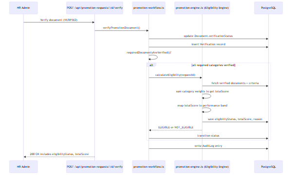

<details>
<summary>Diagram source (Mermaid)</summary>

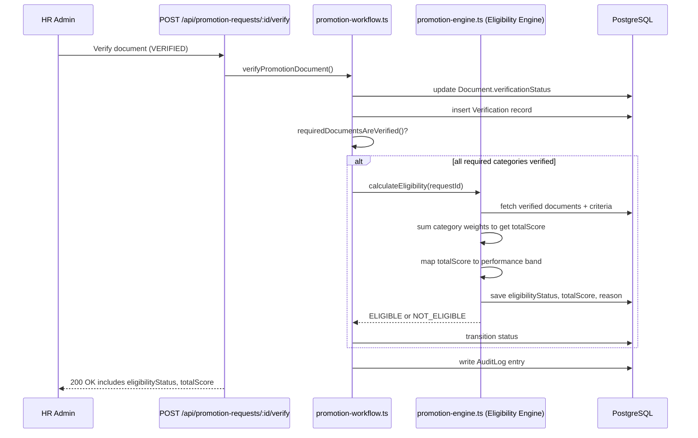

</details>

### 4.7.2 Implementation and a correction made during development

The score is computed from which required evidence categories (Teaching, Research, Service) have been **verified**, each carrying an institutional weight, then mapped onto the same performance bands defined in the approved proposal (§3.17):

```typescript
// lib/promotion-engine.ts
export const CATEGORY_WEIGHTS: Record<DocumentCategory, number> = {
  [DocumentCategory.RESEARCH]: 40,
  [DocumentCategory.TEACHING]: 40,
  [DocumentCategory.SERVICE]: 20,
  // qualifications, publications, professional development, other: 0
};

function scoreBand(score?: number | null) {
  if (score === null || score === undefined) return null;
  if (score >= 70) return 'EXCELLENT';
  if (score >= 65) return 'VERY_GOOD';
  if (score >= 55) return 'GOOD';
  if (score >= 50) return 'SATISFACTORY';
  return 'UNSATISFACTORY';
}
```

During implementation testing, the initial version of `calculateEligibility` computed `totalScore` from a separate per-category `Score` table that no part of the application ever populated (`request.totalScore ?? request.scores.reduce(...)` against an always-empty relation). The practical effect was that **every application received a criteria score of 0 the moment HR finished verifying it**, regardless of how complete the evidence was — a defect only visible once the full workflow was exercised end-to-end, not from reading the eligibility rules in isolation. It was corrected to compute the score directly from verified document categories (shown above), matching the approved proposal's own scoring table exactly. Figure 4.10 shows the corrected engine's output on a fully verified application: a criteria score of 100/100 and an `ELIGIBLE` recommendation.

## 4.8 System Modules

| Module | Location | Responsibility |
|---|---|---|
| Authentication | `lib/auth.ts`, `app/api/auth/**` | Session issuance/verification, registration, email verification, password change |
| Promotion Workflow | `lib/promotion-workflow.ts`, `lib/workflow.ts` | Status transitions, document verification, committee review, role enforcement |
| Eligibility Engine | `lib/promotion-engine.ts` | Score computation and eligibility recommendation |
| Audit Logging | `lib/audit-logger.ts`, `lib/audit.ts` | Append-only action history for every state-changing operation |
| Notifications | `lib/notifications.ts`, `app/api/notifications` | In-app notifications to lecturers on verification/status events |
| Reporting & Analytics | `lib/reporting.ts`, `lib/promotion-analytics.ts`, `app/api/reports`, `app/api/analytics` | CSV/PDF export, dashboard aggregate statistics |
| RBAC | `lib/rbac.ts`, middleware | Role-based route protection |
| Document Storage | `lib/document-file-storage.ts`, `lib/upload.ts`, `app/api/uploads` | Evidence file handling |
| Role dashboards | `app/lecturer-portal`, `app/hod`, `app/hr`, `app/committee`, `app/system-admin` | Role-specific UI surfaces |
| Shared UI shell | `components/AppShell.tsx`, `components/BottomNavigation.tsx`, `components/promotion/PromotionApplicationDetail.tsx` | Responsive layout, shared application-detail view reused across HOD/HR/Committee roles |

## 4.9 Implementation Tools and Technology Stack

| Layer | Technology |
|---|---|
| Framework | Next.js 15 (App Router), React 18, TypeScript |
| Styling | Tailwind CSS, Shadcn UI components |
| ORM / Database | Prisma ORM 6, PostgreSQL (Neon serverless Postgres) |
| Authentication | Session-based auth with `bcrypt` password hashing |
| Email | Resend (transactional email for verification links) |
| Validation | Zod schema validation on API input |
| Hosting | Vercel |
| DNS | Cloudflare (`promotion.techdalt.com` subdomain) |
| Version control | Git |

## 4.10 User Interface Design

The interface is organised around five role-specific portals sharing one responsive application shell: a collapsible sidebar on desktop that becomes a bottom tab bar on mobile (`components/AppShell.tsx`, `components/BottomNavigation.tsx`), so every role gets the same navigation pattern adapted to screen size rather than a separate mobile app.

**Figure 4.6 — Login**
Staff sign in with their official GCTU email. Role is resolved server-side from the account, not selected by the user, so the same login screen routes every role to its own dashboard.

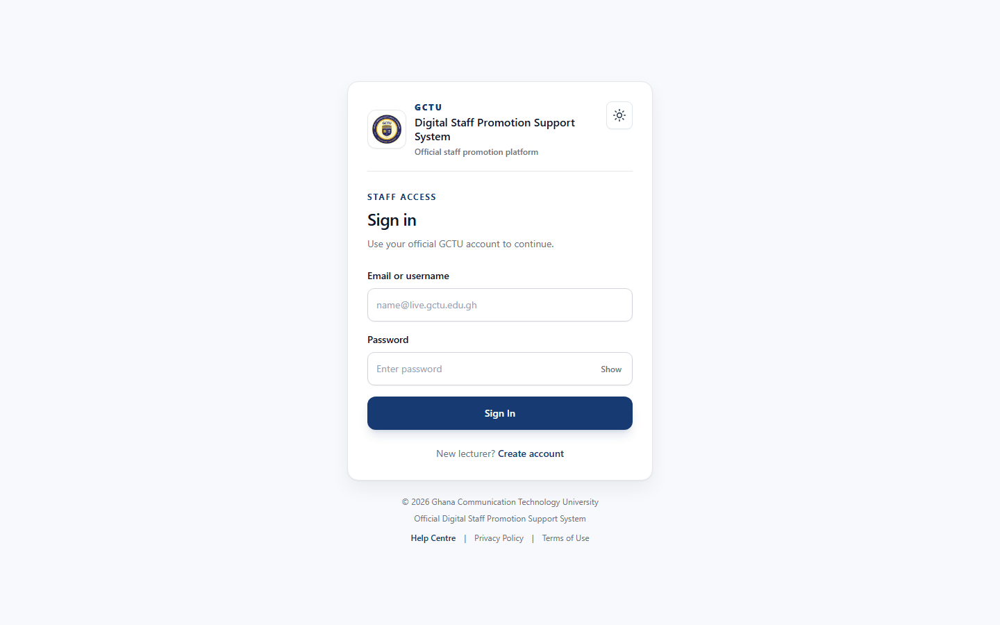

**Figure 4.7 — HOD/Dean Dashboard**
Departmental workload overview: applications pending department-level review, forwarded, or returned.

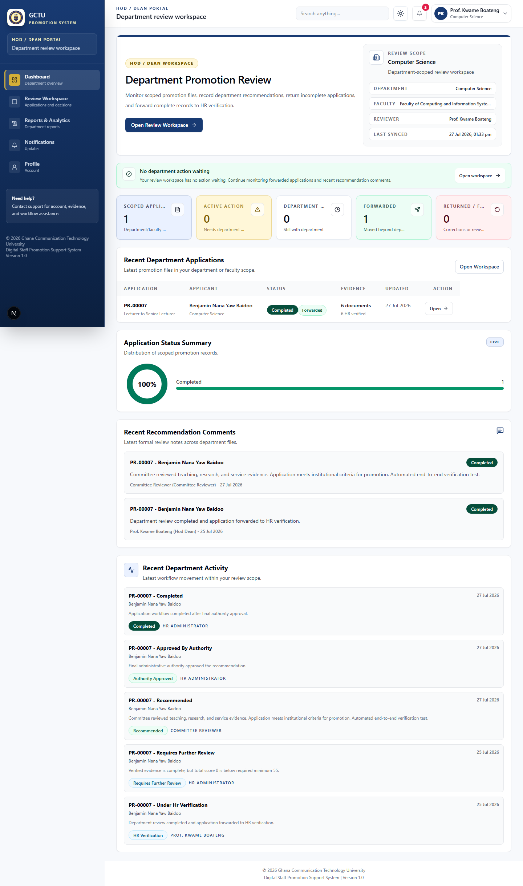

**Figure 4.8 — HR Administrator Dashboard**
Aggregate view of active HR work, returned applications, and completed decisions.

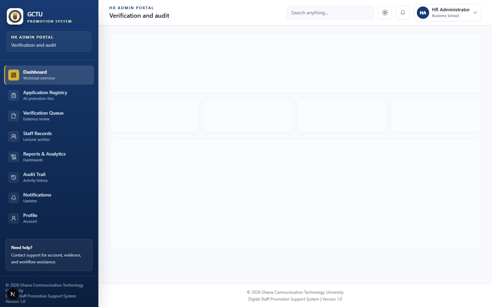

**Figure 4.9 — HR Master Queue**
The full promotion queue with segment/status/eligibility filters and per-request health indicators.

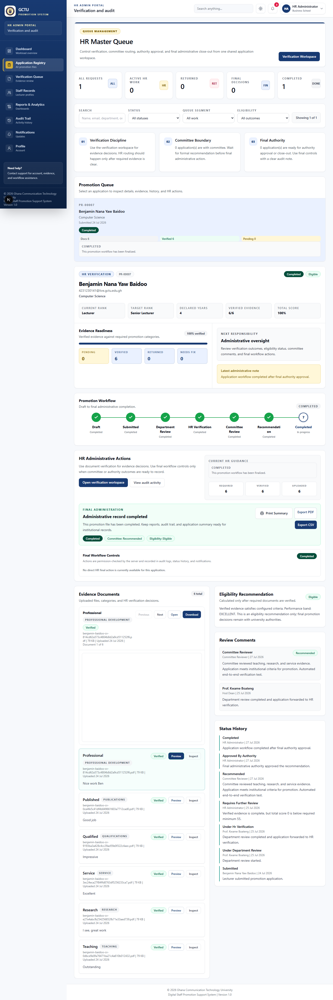

**Figure 4.10 — HR Verification and Eligibility Detail**
The eligibility engine's output on a fully verified application: 6/6 required evidence categories verified, a **Criteria Score of 100/100**, an **Eligible** recommendation shown as a separate status badge with its own explanatory text, complete status history from Draft through Completed, and the committee's recorded recommendation. The criteria score and the eligibility recommendation are displayed as two distinct values, consistent with the terminology set out in §4.7.1, to avoid the numeric score being read as a performance grade.


**Figure 4.11 — Committee Review Queue**
Applications awaiting or having received a formal committee recommendation.

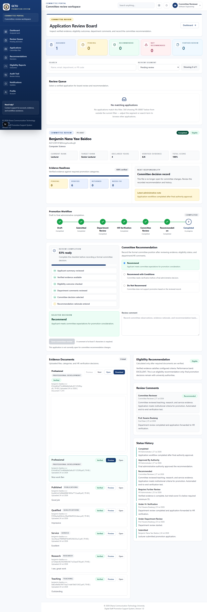

**Figure 4.12 — Analytics and Reports**
Institution-wide promotion workflow statistics, eligibility outcomes, evidence category breakdowns, and export controls (CSV/PDF).


**Figure 4.13 — System Administrator Dashboard**
System-wide configuration and governance overview.


**Figure 4.14 — Promotion Criteria Configuration**
Rank-to-rank promotion criteria (minimum years in rank, required evidence categories, minimum score) configured by the System Administrator rather than hard-coded, as specified in the approved proposal's functional requirements.


**Figure 4.15 — Responsive Mobile Layout**
The same HR dashboard rendered at a 390px mobile viewport width, showing the sidebar collapsed into a bottom tab bar.

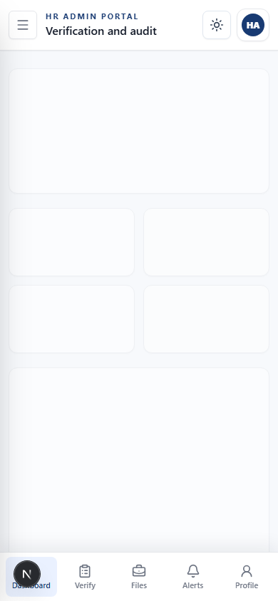

## 4.11 Testing

Testing was carried out at four levels, all against the actual running application rather than isolated unit assertions alone.

### 4.11.1 Static and build verification
- `tsc --noEmit` — full TypeScript compilation with zero errors.
- `next build` — full production build, all 68 routes compiled and prerendered successfully.

### 4.11.2 Database integrity
- A scripted health check (`scripts/db-health-check.js`) verifies live database connectivity, minimum required seed data (faculties, departments, promotion criteria), and that all pre-created role accounts are active, verified, and onboarded.

### 4.11.3 End-to-end workflow testing
The complete promotion pipeline was exercised in a real, headless-browser session (Chromium, driven via Playwright) against the running application — not simulated at the code level:

1. **HR verification** — logged in as HR Administrator, opened a real application record, confirmed all six required evidence documents (Teaching, Research, Service, Qualifications, Publications, Professional Development) as verified.
2. **Eligibility calculation** — confirmed the engine computed a `Criteria Score: 100/100` and an `Eligible` recommendation, and that the application status advanced to `UNDER_COMMITTEE_REVIEW`.
3. **Committee recommendation** — logged in as Committee Reviewer, located the application in the review queue (score visible in the queue list), submitted a `RECOMMENDED` decision through the actual review form, and confirmed the resulting workflow-history and audit-log entries.
4. **HR final decision** — logged back in as HR Administrator, used "Record authority approval" and "Complete workflow" (each behind a confirmation dialog) to move the application to `APPROVED_BY_AUTHORITY` and then `COMPLETED`.
5. **Status history verification** — confirmed the full audit trail was correct and in order end to end: Draft → Submitted → Department Review → HR Verification → Recommended → Approved by Authority → Completed.

This test is what surfaced the scoring defect described in §4.7.2 — the application appeared correct when the eligibility rules were read in isolation, but produced a wrong result (a criteria score of 0 regardless of verified evidence) once actually exercised through the full workflow, which is the justification for testing the running system rather than relying on code review alone.

### 4.11.4 Access control and responsiveness testing
- Verified that role-restricted actions (e.g. committee recommendation submission) are rejected server-side when attempted outside the correct workflow state, independent of what the client UI shows.
- Verified layout at both a 1440px desktop viewport and a 390px mobile viewport across all five role dashboards; confirmed no horizontal overflow or broken layout on any page at either width.

## 4.12 Deployment

The system is deployed as follows:

- **Hosting**: Vercel, building the Next.js application directly from the Git repository.
- **Database**: Neon serverless PostgreSQL, connected via `DATABASE_URL`; the production Prisma schema (`schema.postgres.prisma`) is generated and migrated with `prisma migrate deploy` as part of the deployment script (`deploy:prod`).
- **Domain**: `promotion.techdalt.com`, a Cloudflare-managed subdomain pointed at Vercel via CNAME, kept separate from the existing apex domain's DNS records.
- **Email**: Resend, for transactional account-verification email, using a verified sending domain.
- **Environment configuration**: `AUTH_SECRET`, `DATABASE_URL`, `APP_URL`/`NEXT_PUBLIC_APP_URL`, and `EMAIL_*` variables are set in the Vercel project rather than committed to source control.
- **Health check**: a public `/api/health` endpoint reports application and database connectivity for post-deploy verification.

## 4.13 Chapter Summary

This chapter presented the implemented architecture, database schema, workflow state design, role-based access control, the eligibility decision-support engine (including a real defect found and corrected while testing the live system), the system's modular structure, its user interface across five role-specific portals, the testing carried out against the actual running application, and its production deployment configuration. The next chapter summarises the study, evaluates it against the objectives set out in Chapter 1, and presents conclusions, recommendations, and suggestions for future work.
