# CHAPTER FOUR: SYSTEM DESIGN AND IMPLEMENTATION

## 4.1 Introduction

This chapter presents the design and implementation of the Digital Staff Promotion Support System for Ghana Communication Technology University (GCTU). It covers the system architecture, component and database design, the workflow and decision-support design (expressed through use case, activity, and sequence models), role-based access control, the technology stack, the implemented system modules, the user interface, the testing carried out on the working system, and the deployment configuration.

Every diagram, code snippet, and screenshot in this chapter is drawn directly from the implemented and verified system. The prototype described in Chapter 3 has been built, its scoring logic corrected during implementation (§4.9.2), and its full workflow — lecturer submission, HOD/Dean review, HR verification, committee recommendation, and HR final decision — has been exercised end-to-end in a live browser session, not merely inspected in source code.

## 4.2 System Architecture

The system follows the three-tier architecture proposed in Chapter 3: a presentation layer, an application layer, and a data layer, implemented as a single Next.js application with a PostgreSQL (Neon) database accessed through Prisma ORM.

**Figure 4.1 — System Architecture**


<details>
<summary>Diagram source (Mermaid)</summary>

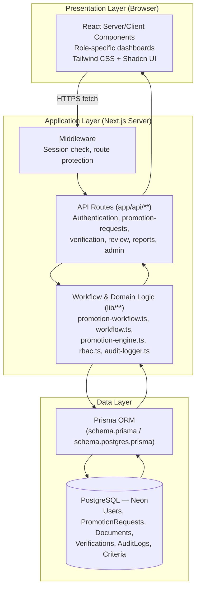
```mermaid
flowchart TB
    subgraph Client["Presentation Layer (Browser)"]
        UI["React Server/Client Components\nRole-specific dashboards\nTailwind CSS + Shadcn UI"]
    end

    subgraph Server["Application Layer (Next.js Server)"]
        MW["Middleware\nSession check, route protection"]
        API["API Routes (app/api/**)\nAuthentication, promotion-requests,\nverification, review, reports, admin"]
        WF["Workflow & Domain Logic (lib/**)\npromotion-workflow.ts, workflow.ts,\npromotion-engine.ts, rbac.ts, audit-logger.ts"]
    end

    subgraph Data["Data Layer"]
        PRISMA["Prisma ORM\n(schema.prisma / schema.postgres.prisma)"]
        DB[("PostgreSQL — Neon\nUsers, PromotionRequests, Documents,\nVerifications, AuditLogs, Criteria")]
    end

    UI -->|HTTPS fetch| MW --> API --> WF --> PRISMA --> DB
    DB --> PRISMA --> WF --> API --> UI
```

</details>

- **Presentation layer** — role-specific dashboards (Lecturer, HOD/Dean, HR Admin, Committee Reviewer, System Admin), each rendered from shared layout components (`AppShell.tsx`, `BottomNavigation.tsx`) so navigation adapts automatically between a desktop sidebar and a mobile bottom tab bar.
- **Application layer** — Next.js API routes under `app/api/` handle authentication, promotion-request lifecycle, document verification, committee review, and reporting. Business rules (status transitions, eligibility calculation, audit logging) are isolated in `lib/`, not scattered across route handlers, so the same rules apply regardless of which route calls them.
- **Data layer** — Prisma ORM maps the domain model to PostgreSQL hosted on Neon. Two schema files exist (`schema.prisma` for local development, `schema.postgres.prisma` for the deployed Postgres target); the correct one is selected automatically at build time by `scripts/prisma-generate.js` based on the `VERCEL` / `NODE_ENV` environment.

## 4.3 Component Design

While §4.2 shows the three architectural *layers*, Figure 4.2 shows how the system is organised into discrete *modules* within those layers and how they depend on one another. Each of the five role-specific portals depends only on the domain modules it actually needs (for example, the Lecturer Portal depends on the Document Upload module but not on the Department Scope module used by HOD/Dean), and every domain module reaches the database only through the shared Prisma ORM layer rather than issuing its own ad-hoc queries.

**Figure 4.2 — Component Diagram**

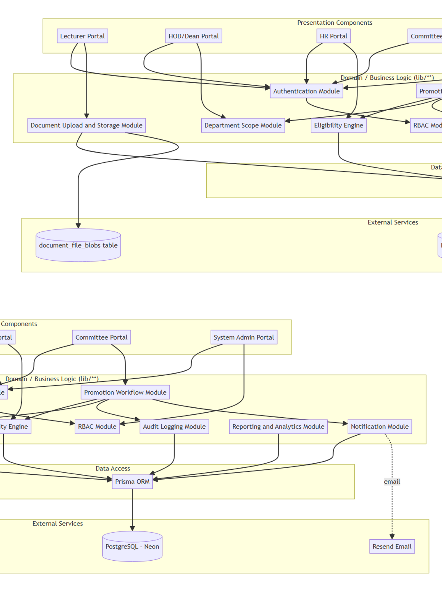

<details>
<summary>Diagram source (Mermaid)</summary>

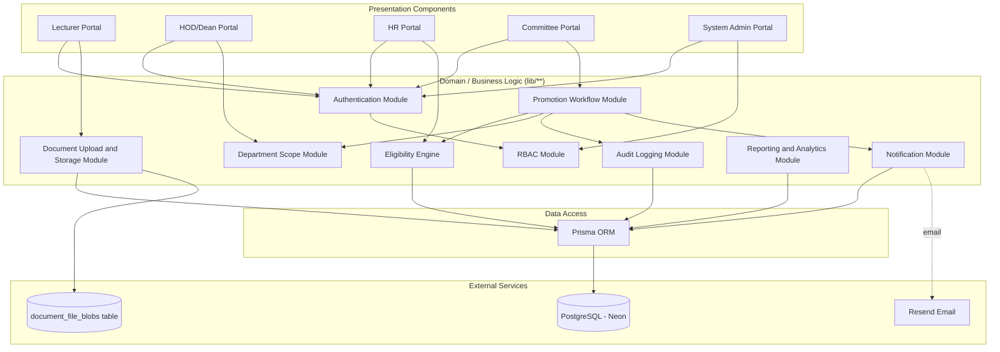
```mermaid
flowchart TB
    subgraph UI["Presentation Components"]
        LP[Lecturer Portal]
        HODP[HOD/Dean Portal]
        HRP[HR Portal]
        CP[Committee Portal]
        SAP[System Admin Portal]
    end

    subgraph Domain["Domain / Business Logic (lib/**)"]
        AUTH[Authentication Module]
        WFm[Promotion Workflow Module]
        ENGm[Eligibility Engine]
        RBAC[RBAC Module]
        SCOPEm[Department Scope Module]
        AUDITm[Audit Logging Module]
        NOTIFm[Notification Module]
        REPORTm[Reporting and Analytics Module]
        UPLOADm[Document Upload and Storage Module]
    end

    subgraph Data["Data Access"]
        PRISMA[Prisma ORM]
    end

    subgraph External["External Services"]
        PG[(PostgreSQL - Neon)]
        RESEND[Resend Email]
        BLOB[(document_file_blobs table)]
    end

    LP --> AUTH
    HODP --> AUTH
    HRP --> AUTH
    CP --> AUTH
    SAP --> AUTH
    LP --> UPLOADm
    HODP --> SCOPEm
    HRP --> ENGm
    CP --> WFm
    SAP --> RBAC

    AUTH --> RBAC
    WFm --> ENGm
    WFm --> SCOPEm
    WFm --> AUDITm
    WFm --> NOTIFm
    ENGm --> PRISMA
    UPLOADm --> PRISMA
    UPLOADm --> BLOB
    AUDITm --> PRISMA
    REPORTm --> PRISMA
    NOTIFm --> PRISMA
    NOTIFm -. email .-> RESEND
    PRISMA --> PG
```

</details>

One module is worth highlighting because it does not appear in Chapter 3's original design and was added to satisfy a requirement discovered during implementation: the **Department Scope Module** (`lib/department-scope.ts`). Chapter 3 specified role-based access control for five roles, but did not fully specify how a department-level reviewer's visibility should be restricted when there are multiple HOD/Dean accounts across different departments and faculties. This module computes, for any HOD/Dean user, the correct Prisma `WHERE` filter to scope their queue, dashboard, and report exports to their own department (or their own faculty, for a Dean with no single department assigned), and separately computes the correct notification recipients when a lecturer submits an application — matching by `departmentId` first, falling back to department name, then to the faculty-level Dean, and finally to all HOD/Dean and System Admin accounts if no scoped reviewer exists, so that a submission is never silently unrouted. This directly answers a functional requirement implicit in the approved proposal's five-role model: a Business Faculty lecturer's submission must reach the Business Faculty's HOD, not an HOD in an unrelated department.

## 4.4 Database Design

The database is relational and is modelled through Prisma. Figure 4.3 redraws the main operational entities as an entity-relationship model rather than a raw database dump: it highlights the tables that carry the promotion workflow, the key foreign-key paths between them, and the audit records that make each application traceable. Auxiliary compatibility tables such as legacy `Lecturer`/`AdminAccount` records and general `SystemSetting` key-value entries are omitted so the diagram remains focused on the implemented promotion process.

**Figure 4.3 — Entity Relationship Diagram**


<details>
<summary>Diagram source (Mermaid)</summary>

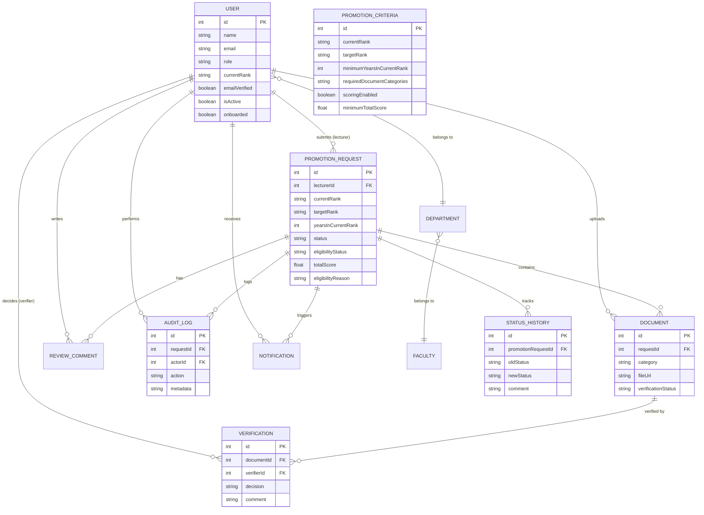
```mermaid
erDiagram
    USER ||--o{ PROMOTION_REQUEST : "submits (lecturer)"
    USER ||--o{ DOCUMENT : uploads
    USER ||--o{ VERIFICATION : "decides (verifier)"
    USER ||--o{ REVIEW_COMMENT : writes
    USER ||--o{ AUDIT_LOG : performs
    USER ||--o{ NOTIFICATION : receives
    USER }o--|| DEPARTMENT : "belongs to"
    DEPARTMENT }o--|| FACULTY : "belongs to"

    PROMOTION_REQUEST ||--o{ DOCUMENT : contains
    PROMOTION_REQUEST ||--o{ REVIEW_COMMENT : has
    PROMOTION_REQUEST ||--o{ AUDIT_LOG : logs
    PROMOTION_REQUEST ||--o{ STATUS_HISTORY : tracks
    PROMOTION_REQUEST ||--o{ NOTIFICATION : triggers

    DOCUMENT ||--o{ VERIFICATION : "verified by"

    PROMOTION_CRITERIA {
        int id PK
        string currentRank
        string targetRank
        int minimumYearsInCurrentRank
        string requiredDocumentCategories
        boolean scoringEnabled
        float minimumTotalScore
    }

    USER {
        int id PK
        string name
        string email
        string role
        string currentRank
        boolean emailVerified
        boolean isActive
        boolean onboarded
    }

    PROMOTION_REQUEST {
        int id PK
        int lecturerId FK
        string currentRank
        string targetRank
        int yearsInCurrentRank
        string status
        string eligibilityStatus
        float totalScore
        string eligibilityReason
    }

    DOCUMENT {
        int id PK
        int requestId FK
        string category
        string fileUrl
        string verificationStatus
    }

    VERIFICATION {
        int id PK
        int documentId FK
        int verifierId FK
        string decision
        string comment
    }

    STATUS_HISTORY {
        int id PK
        int promotionRequestId FK
        string oldStatus
        string newStatus
        string comment
    }

    AUDIT_LOG {
        int id PK
        int requestId FK
        int actorId FK
        string action
        string metadata
    }
```

</details>

Key design points:

- **`PromotionRequest`** is the aggregate root of the workflow — it carries `status` (the workflow stage, e.g. `UNDER_HR_VERIFICATION`), `eligibilityStatus` and `totalScore` (the decision-support outcome, computed — never entered directly by a user).
- **`Document`** and **`Verification`** are separate entities, matching the design in Chapter 3 exactly: a `Document` caches its current `verificationStatus` for fast display, while every individual verify/reject decision is additionally recorded as its own `Verification` row (verifier, decision, comment, timestamp) for a complete audit trail. Every document a lecturer uploads must belong to one of the university's evidence categories (`TEACHING`, `RESEARCH`, `SERVICE`, `QUALIFICATIONS`, `PUBLICATIONS`, `PROFESSIONAL_DEVELOPMENT`, `OTHER_SUPPORTING_EVIDENCE`).
- **`AuditLog`** and **`StatusHistory`** are append-only: every verification decision, status change, and eligibility calculation writes a record, which is what makes the Status History panel shown in Figure 4.18 possible.
- **`PromotionCriteria`** externalises the promotion rules (required years in rank, required evidence categories, minimum score) per rank transition, so criteria can be reconfigured by a System Administrator without a code change.
- Uploaded evidence files are stored durably as a `document_file_blobs` table (binary column, one row per `Document`, `ON DELETE CASCADE`) rather than solely on local disk, so evidence survives redeployment on Vercel's stateless hosting rather than depending on an ephemeral filesystem.

## 4.5 Promotion Workflow State Design

The `PromotionRequest.status` field is a finite state machine. Valid transitions are enforced centrally in `lib/workflow.ts` — a request can only move to a new status if that transition is both a legal state-machine edge *and* permitted for the acting user's role, so a Committee Reviewer, for example, cannot move a request into `UNDER_HR_VERIFICATION`.

**Figure 4.4 — Promotion Workflow State Diagram**

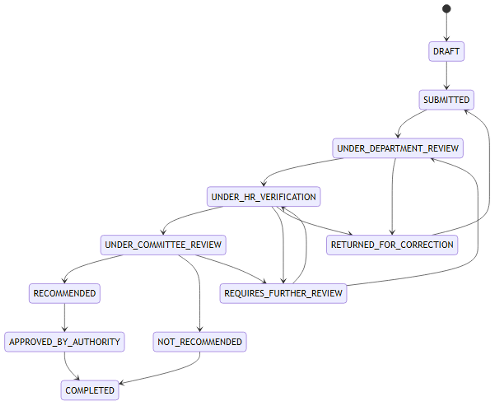

<details>
<summary>Diagram source (Mermaid)</summary>

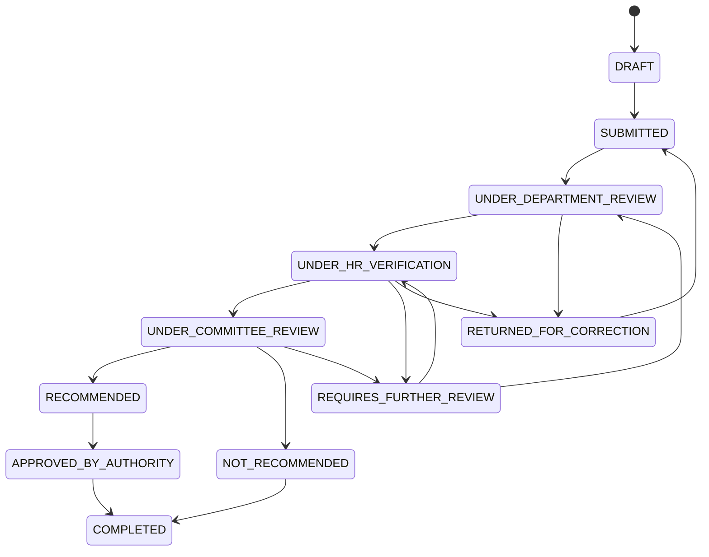
```mermaid
stateDiagram-v2
    [*] --> DRAFT
    DRAFT --> SUBMITTED
    SUBMITTED --> UNDER_DEPARTMENT_REVIEW
    UNDER_DEPARTMENT_REVIEW --> UNDER_HR_VERIFICATION
    UNDER_DEPARTMENT_REVIEW --> RETURNED_FOR_CORRECTION
    RETURNED_FOR_CORRECTION --> SUBMITTED
    UNDER_HR_VERIFICATION --> UNDER_COMMITTEE_REVIEW
    UNDER_HR_VERIFICATION --> REQUIRES_FURTHER_REVIEW
    UNDER_HR_VERIFICATION --> RETURNED_FOR_CORRECTION
    UNDER_COMMITTEE_REVIEW --> RECOMMENDED
    UNDER_COMMITTEE_REVIEW --> NOT_RECOMMENDED
    UNDER_COMMITTEE_REVIEW --> REQUIRES_FURTHER_REVIEW
    RECOMMENDED --> APPROVED_BY_AUTHORITY
    APPROVED_BY_AUTHORITY --> COMPLETED
    NOT_RECOMMENDED --> COMPLETED
    REQUIRES_FURTHER_REVIEW --> UNDER_HR_VERIFICATION
    REQUIRES_FURTHER_REVIEW --> UNDER_DEPARTMENT_REVIEW
```

</details>

*(`UNDER_HR_VERIFICATION → UNDER_COMMITTEE_REVIEW` occurs when all required evidence categories are verified and the computed score meets the configured threshold; otherwise the request routes to `REQUIRES_FURTHER_REVIEW`.)*

## 4.6 Use Case Model

Figure 4.5 presents the use case model using the standard UML convention: human actors are placed outside the system boundary, while the use cases supported by the Digital Staff Promotion Support System are placed inside the boundary. This distinction is important because it shows that lecturers, HODs/Deans, HR officers, committee reviewers, and system administrators interact with the system, but the system itself owns the application, verification, eligibility, reporting, and audit functions.

**Figure 4.5 — Use Case Diagram**


<details>
<summary>Diagram source (Mermaid)</summary>

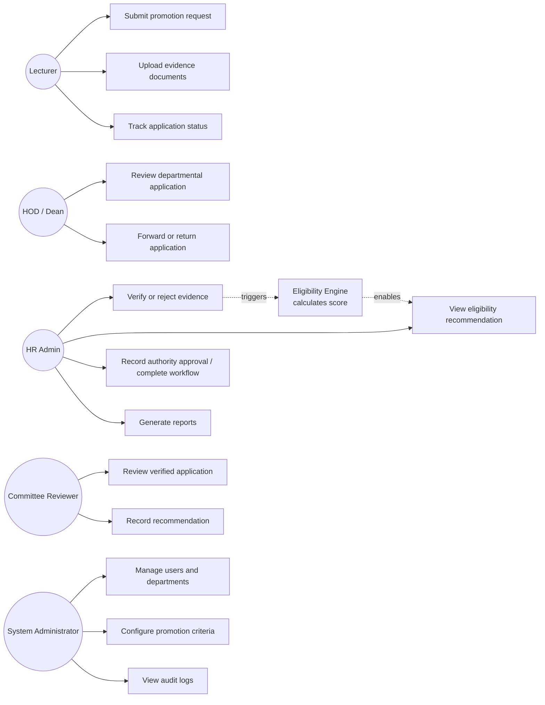
```mermaid
flowchart LR
    Lecturer((Lecturer))
    HOD((HOD / Dean))
    HR((HR Admin))
    Committee((Committee Reviewer))
    SysAdmin((System Administrator))

    Lecturer --> UC1[Submit promotion request]
    Lecturer --> UC2[Upload evidence documents]
    Lecturer --> UC3[Track application status]

    HOD --> UC4[Review departmental application]
    HOD --> UC5[Forward or return application]

    HR --> UC6[Verify or reject evidence]
    HR --> UC7[View eligibility recommendation]
    HR --> UC8[Record authority approval / complete workflow]
    HR --> UC9[Generate reports]

    Committee --> UC10[Review verified application]
    Committee --> UC11[Record recommendation]

    SysAdmin --> UC12[Manage users and departments]
    SysAdmin --> UC13[Configure promotion criteria]
    SysAdmin --> UC14[View audit logs]

    UC6 -.triggers.-> UC15[Eligibility Engine\ncalculates score]
    UC15 -.enables.-> UC7
```

</details>

## 4.7 Activity and Sequence Models

The use case diagram (§4.6) shows *what* each role can do; this section shows *how* those actions actually flow, both across roles (activity diagrams) and between system components (sequence diagrams).

### 4.7.1 Overall Promotion Process

Figure 4.6 shows the complete cross-role process as a formal activity model, from lecturer submission through to a recorded institutional decision. The figure is drawn vertically to match a portrait thesis page and to keep each workflow decision readable. It also preserves the main exception paths: missing evidence returns to the lecturer, incomplete academic review returns for correction, failed HR verification requests correction, and committee further-review decisions route back for HR action.

**Figure 4.6 — Overall Promotion Process (Activity Diagram)**

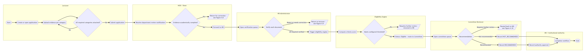

<details>
<summary>Diagram source (Mermaid)</summary>

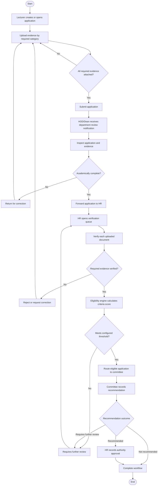
```mermaid
flowchart TD
    Start([Start]) --> A1[Lecturer creates or opens application]
    A1 --> A2[Upload evidence by required category]
    A2 --> A3{All required evidence attached?}
    A3 -- No --> A2
    A3 -- Yes --> A4[Submit application]

    A4 --> B1[HOD/Dean receives department review notification]
    B1 --> B2[Inspect application and evidence]
    B2 --> B3{Academically complete?}
    B3 -- No --> B4[Return for correction]
    B4 --> A2
    B3 -- Yes --> B5[Forward application to HR]

    B5 --> C1[HR opens verification queue]
    C1 --> C2[Verify each uploaded document]
    C2 --> C3{Required evidence verified?}
    C3 -- No --> C4[Reject or request correction]
    C4 --> A2
    C3 -- Yes --> D1[Eligibility engine calculates criteria score]

    D1 --> D2{Meets configured threshold?}
    D2 -- No --> D3[Requires further review]
    D3 --> C1
    D2 -- Yes --> E1[Route eligible application to committee]

    E1 --> E2[Committee records recommendation]
    E2 --> E3{Recommendation outcome}
    E3 -- Requires further review --> D3
    E3 -- Not recommended --> F2[Complete workflow]
    E3 -- Recommended --> F1[HR records authority approval]
    F1 --> F2
    F2 --> End([End])
```

</details>

### 4.7.2 Lecturer Application Process

**Figure 4.7 — Lecturer Application Activity Diagram**

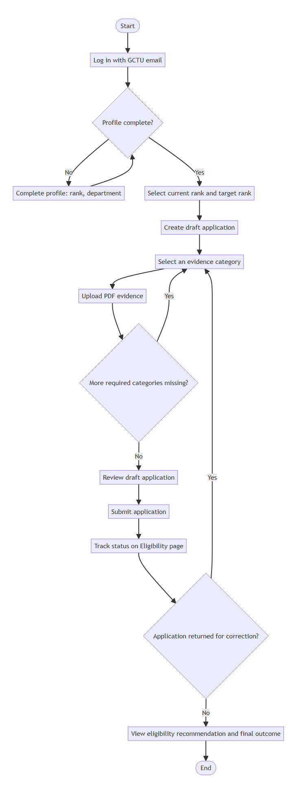

<details>
<summary>Diagram source (Mermaid)</summary>

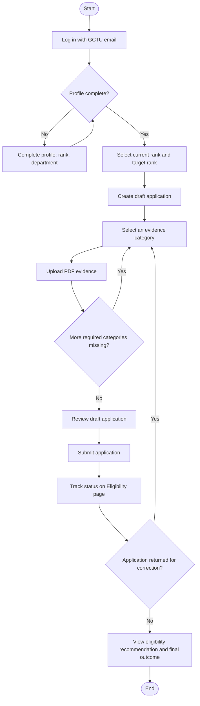
```mermaid
flowchart TD
    Start([Start]) --> Login[Log in with GCTU email]
    Login --> Profile{Profile complete?}
    Profile -- No --> CompleteProfile[Complete profile: rank, department]
    CompleteProfile --> Profile
    Profile -- Yes --> RankSelect[Select current rank and target rank]
    RankSelect --> Draft[Create draft application]
    Draft --> ChooseCat[Select an evidence category]
    ChooseCat --> UploadFile[Upload PDF evidence]
    UploadFile --> MoreCats{More required categories missing?}
    MoreCats -- Yes --> ChooseCat
    MoreCats -- No --> ReviewDraft[Review draft application]
    ReviewDraft --> Submit[Submit application]
    Submit --> Track[Track status on Eligibility page]
    Track --> Returned{Application returned for correction?}
    Returned -- Yes --> ChooseCat
    Returned -- No --> ViewResult[View eligibility recommendation and final outcome]
    ViewResult --> End([End])
```

</details>

### 4.7.3 HOD/Dean Review Process

Chapter 3 defines a single `HOD_DEAN` role; in practice it covers two review scopes rather than two separate roles. An account assigned a specific department reviews as an HOD, scoped to that department only; an account assigned only a faculty (no department) reviews as a Dean, scoped to every department within that faculty. Both use the same workspace and the same three decision outcomes.

Verification against GCTU's Conditions of Service (section 10.1) and Basic Laws (Schedule J, section 1.3(2)(c)) confirms that academic promotion applications are submitted to the applicant's Head of Department first; the HOD forwards the application with comments to the Dean, who refers it to the Faculty Appointments and Promotions Sub-Committee. A complete institutional configuration can therefore contain one active HOD account for each department and one active Dean account for each faculty or school, using personal rather than shared logins. The demonstration database creates representative officeholders only. System Admin account creation requires an explicit HOD or Dean appointment type, enforces department assignment for HODs and faculty-only assignment for Deans, and prevents duplicate active office assignments. The governed workflow now preserves distinct Department, Faculty/FAPC, external-assessment where required, UAPC, Council where required, final-notification, and appeal records. If a lawful FAPC cannot be constituted, HRODD may waive that stage only after a named failed-quorum record and formal resolution have been stored; later mandatory evidence controls remain active.

**Figure 4.8 — HOD/Dean Review Activity Diagram**

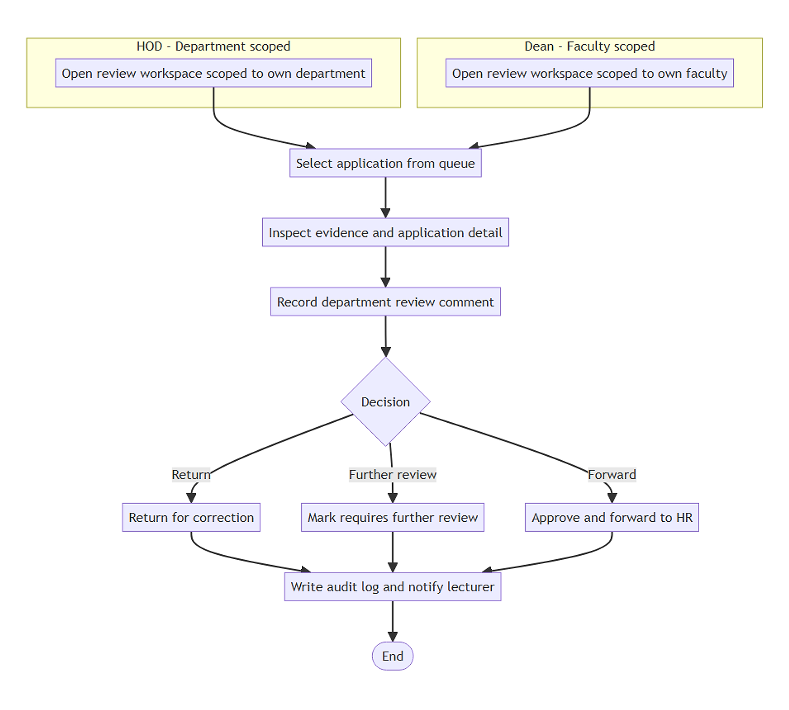

<details>
<summary>Diagram source (Mermaid)</summary>

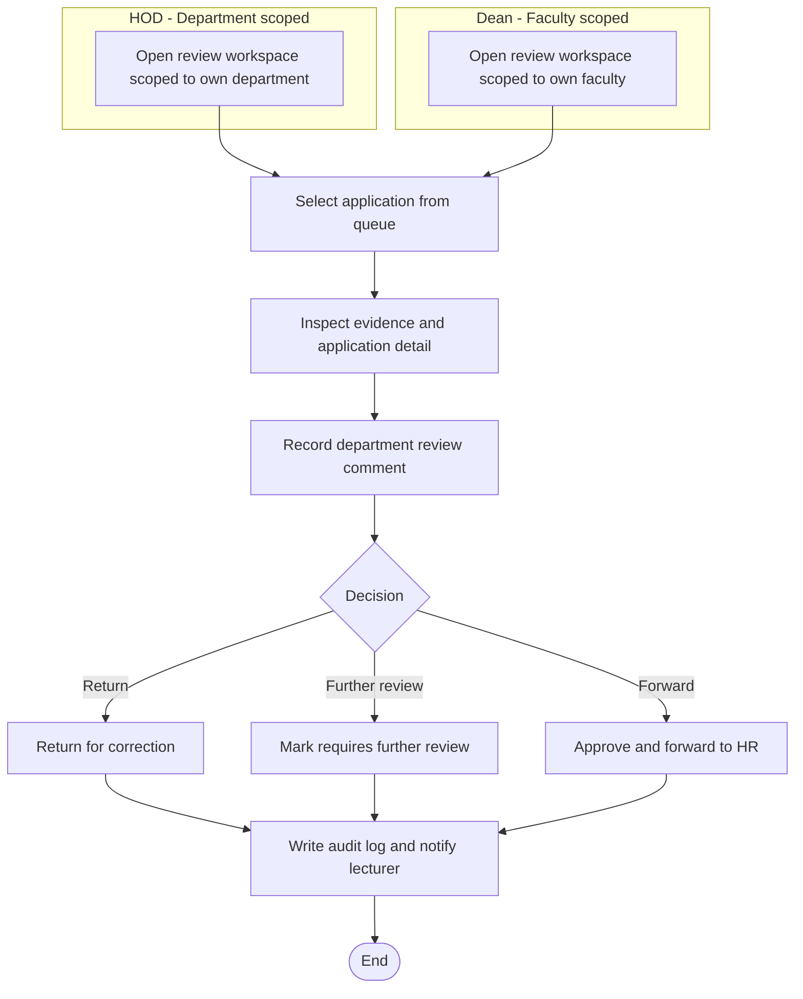
```mermaid
flowchart TD
    subgraph HOD["HOD - Department scoped"]
        H1[Open review workspace scoped to own department]
    end
    subgraph Dean["Dean - Faculty scoped"]
        D1[Open review workspace scoped to own faculty]
    end
    H1 --> Q[Select application from queue]
    D1 --> Q
    Q --> Insp[Inspect evidence and application detail]
    Insp --> Comment[Record department review comment]
    Comment --> Decision{Decision}
    Decision -- Return --> Return[Return for correction]
    Decision -- Further review --> Further[Mark requires further review]
    Decision -- Forward --> Forward[Approve and forward to HR]
    Return --> Audit[Write audit log and notify lecturer]
    Further --> Audit
    Forward --> Audit
    Audit --> End([End])
```

</details>

### 4.7.4 HR Verification and Eligibility Process

**Figure 4.9 — HR Verification and Eligibility Activity Diagram**

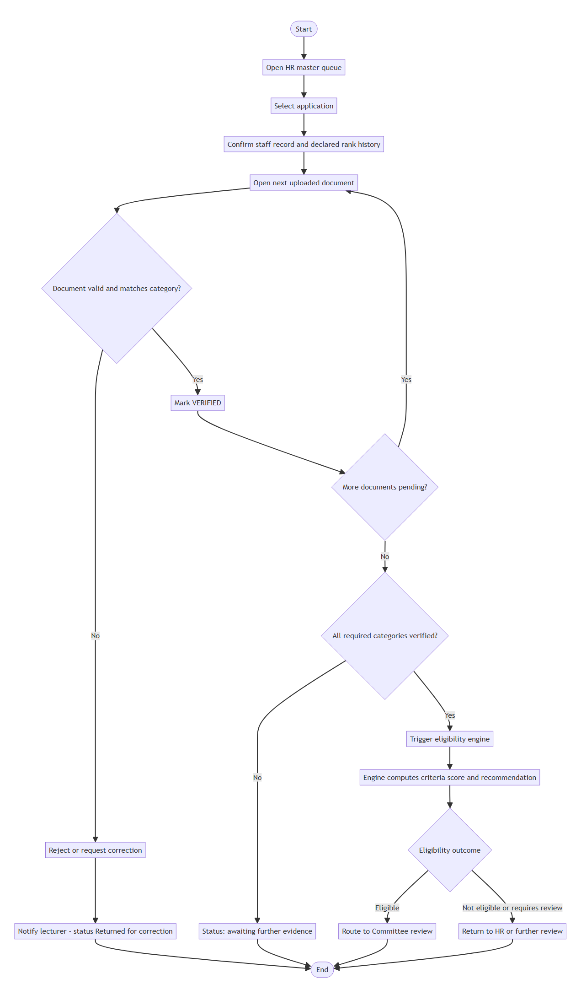

<details>
<summary>Diagram source (Mermaid)</summary>

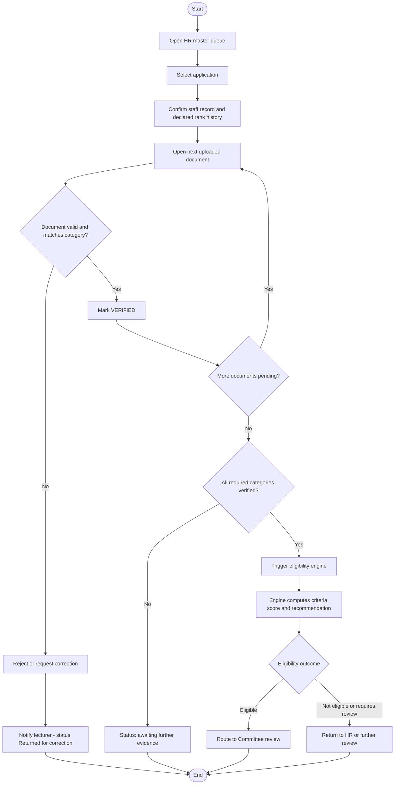
```mermaid
flowchart TD
    Start([Start]) --> Q[Open HR master queue]
    Q --> Select[Select application]
    Select --> ConfirmStaff[Confirm staff record and declared rank history]
    ConfirmStaff --> PerDoc[Open next uploaded document]
    PerDoc --> Check{Document valid and matches category?}
    Check -- No --> RejectDoc[Reject or request correction]
    RejectDoc --> NotifyLect[Notify lecturer - status Returned for correction]
    Check -- Yes --> VerifyDoc[Mark VERIFIED]
    VerifyDoc --> MoreDocs{More documents pending?}
    MoreDocs -- Yes --> PerDoc
    MoreDocs -- No --> AllReq{All required categories verified?}
    AllReq -- No --> Wait[Status: awaiting further evidence]
    AllReq -- Yes --> Trigger[Trigger eligibility engine]
    Trigger --> Compute[Engine computes criteria score and recommendation]
    Compute --> Route{Eligibility outcome}
    Route -- Eligible --> ToCommittee[Route to Committee review]
    Route -- Not eligible or requires review --> BackHR[Return to HR or further review]
    ToCommittee --> End([End])
    BackHR --> End
    NotifyLect --> End
    Wait --> End
```

</details>

### 4.7.5 Committee Review Process

**Figure 4.10 — Committee Review Activity Diagram**

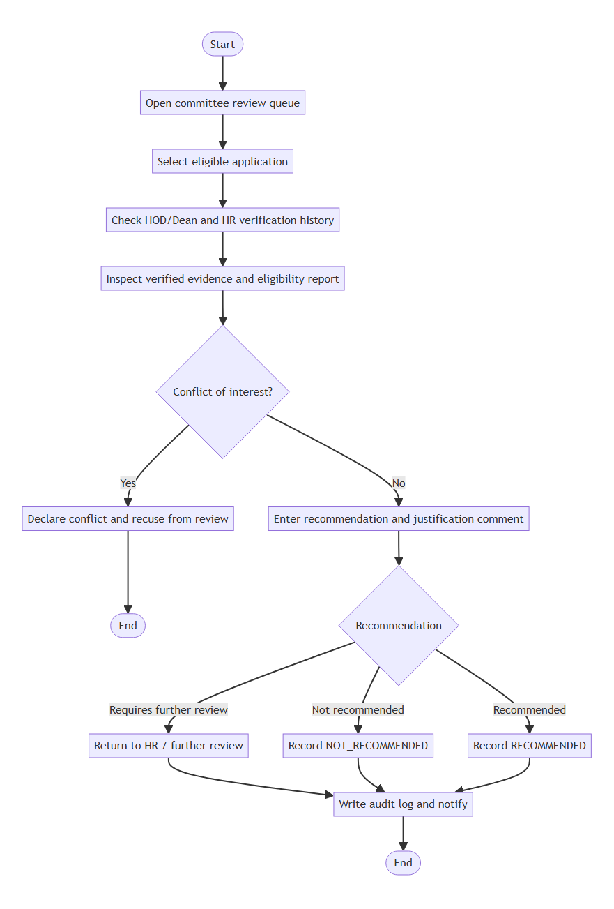

<details>
<summary>Diagram source (Mermaid)</summary>

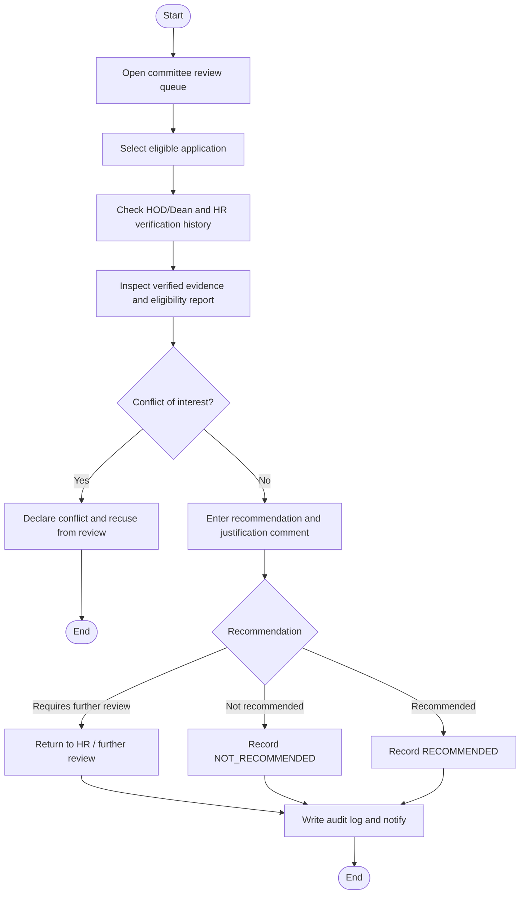
```mermaid
flowchart TD
    Start([Start]) --> Q[Open committee review queue]
    Q --> Select[Select eligible application]
    Select --> CheckPrior[Check HOD/Dean and HR verification history]
    CheckPrior --> Evidence[Inspect verified evidence and eligibility report]
    Evidence --> COI{Conflict of interest?}
    COI -- Yes --> Recuse[Declare conflict and recuse from review]
    Recuse --> End1([End])
    COI -- No --> Justify[Enter recommendation and justification comment]
    Justify --> Decision{Recommendation}
    Decision -- Requires further review --> BackHR[Return to HR / further review]
    Decision -- Not recommended --> NotRec[Record NOT_RECOMMENDED]
    Decision -- Recommended --> Rec[Record RECOMMENDED]
    BackHR --> Audit[Write audit log and notify]
    NotRec --> Audit
    Rec --> Audit
    Audit --> End2([End])
```

</details>

**Committee conflict-of-interest handling.** Every recorded committee participant now has explicit attendance, conflict-declaration, conflict-details, recusal, rank-eligibility, chair, and secretary fields. The server excludes the applicant, conflicted or recused members, and members below the target rank before computing case-specific quorum. A stage cannot be completed without named participant records, valid quorum, a resolution, and an explicit recommendation. Authorized users may record a replacement membership record when the committee is reconvened; the earlier failed or recused record remains in the audit history.

### 4.7.6 Application Submission and Routing (Sequence Diagram)

Figure 4.11 shows how a submission is routed to the correct HOD/Dean, expanding on the Department Scope Module introduced in §4.3.

**Figure 4.11 — Application Submission and Routing Sequence Diagram**

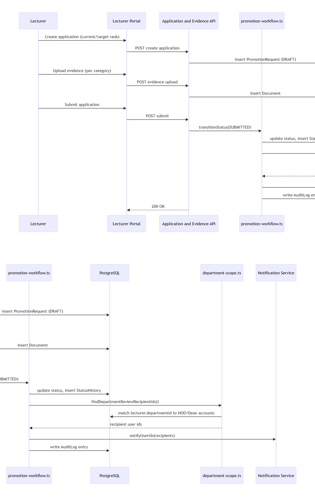

<details>
<summary>Diagram source (Mermaid)</summary>

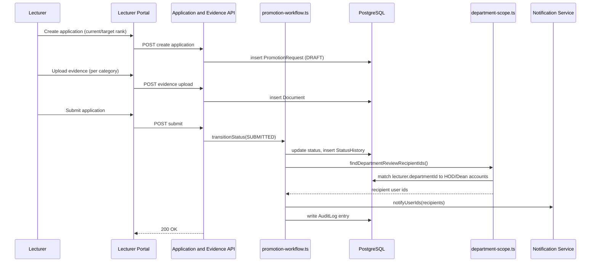
```mermaid
sequenceDiagram
    participant L as Lecturer
    participant UI as Lecturer Portal
    participant API as Application and Evidence API
    participant WF as promotion-workflow.ts
    participant DB as PostgreSQL
    participant SCOPE as department-scope.ts
    participant N as Notification Service

    L->>UI: Create application (current/target rank)
    UI->>API: POST create application
    API->>DB: insert PromotionRequest (DRAFT)
    L->>UI: Upload evidence (per category)
    UI->>API: POST evidence upload
    API->>DB: insert Document
    L->>UI: Submit application
    UI->>API: POST submit
    API->>WF: transitionStatus(SUBMITTED)
    WF->>DB: update status, insert StatusHistory
    WF->>SCOPE: findDepartmentReviewRecipientIds()
    SCOPE->>DB: match lecturer.departmentId to HOD/Dean accounts
    SCOPE-->>WF: recipient user ids
    WF->>N: notifyUserIds(recipients)
    WF->>DB: write AuditLog entry
    API-->>UI: 200 OK
```

</details>

### 4.7.7 Eligibility Calculation (Sequence Diagram)

Figure 4.12 separates the eligibility calculation into the actors and services that participate in the implemented request: HR initiates the calculation after evidence verification, the API validates the request, the workflow service loads and persists the application state, the eligibility engine applies configured criteria to verified documents only, and the audit/notification layer records the outcome for traceability. This makes the diagram useful for implementation review because it shows both the calculation path and the supporting persistence/audit actions.

**Figure 4.12 — Eligibility Calculation Sequence Diagram**


<details>
<summary>Diagram source (Mermaid)</summary>

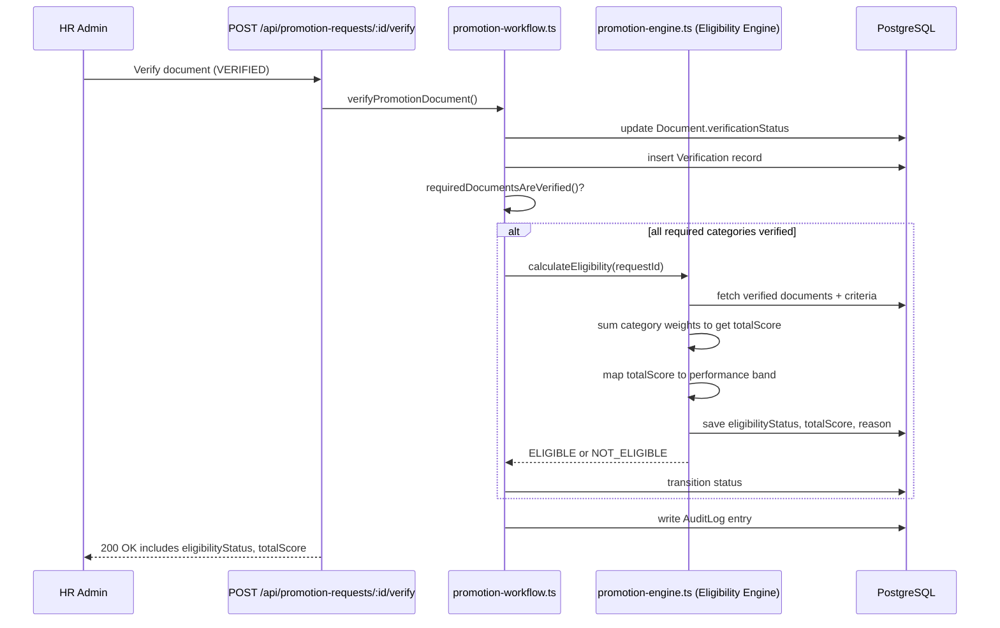
```mermaid
sequenceDiagram
    participant HR as HR Admin
    participant API as POST /api/promotion-requests/:id/verify
    participant WF as promotion-workflow.ts
    participant ENG as promotion-engine.ts (Eligibility Engine)
    participant DB as PostgreSQL

    HR->>API: Verify document (VERIFIED)
    API->>WF: verifyPromotionDocument()
    WF->>DB: update Document.verificationStatus
    WF->>DB: insert Verification record
    WF->>WF: requiredDocumentsAreVerified()?
    alt all required categories verified
        WF->>ENG: calculateEligibility(requestId)
        ENG->>DB: fetch verified documents + criteria
        ENG->>ENG: sum category weights to get totalScore
        ENG->>ENG: map totalScore to performance band
        ENG->>DB: save eligibilityStatus, totalScore, reason
        ENG-->>WF: ELIGIBLE or NOT_ELIGIBLE
        WF->>DB: transition status
    end
    WF->>DB: write AuditLog entry
    API-->>HR: 200 OK includes eligibilityStatus, totalScore
```

</details>

The full design rationale, implementation, and the scoring defect found and corrected during development are discussed in §4.9.

### 4.7.8 Committee Recommendation and Final Recording (Sequence Diagram)

Figure 4.13 shows the separation that is central to this project's approved scope: the Committee records a *recommendation*, and HR separately records the *institutional authority's* decision. The system never treats the committee's recommendation as the final decision.

**Figure 4.13 — Committee Recommendation and Final Recording Sequence Diagram**

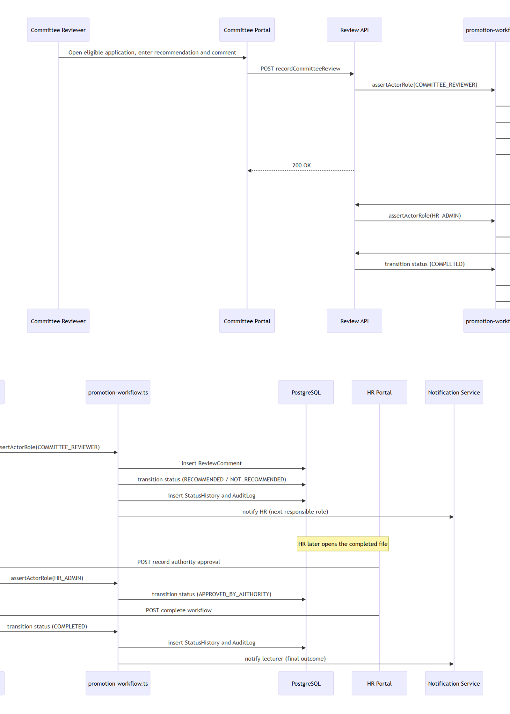

<details>
<summary>Diagram source (Mermaid)</summary>

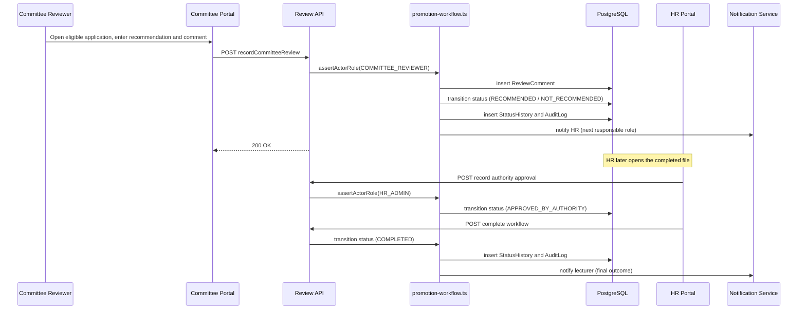
```mermaid
sequenceDiagram
    participant C as Committee Reviewer
    participant UI as Committee Portal
    participant API as Review API
    participant WF as promotion-workflow.ts
    participant DB as PostgreSQL
    participant HRU as HR Portal
    participant N as Notification Service

    C->>UI: Open eligible application, enter recommendation and comment
    UI->>API: POST recordCommitteeReview
    API->>WF: assertActorRole(COMMITTEE_REVIEWER)
    WF->>DB: insert ReviewComment
    WF->>DB: transition status (RECOMMENDED / NOT_RECOMMENDED)
    WF->>DB: insert StatusHistory and AuditLog
    WF->>N: notify HR (next responsible role)
    API-->>UI: 200 OK
    Note over HRU,DB: HR later opens the completed file
    HRU->>API: POST record authority approval
    API->>WF: assertActorRole(HR_ADMIN)
    WF->>DB: transition status (APPROVED_BY_AUTHORITY)
    HRU->>API: POST complete workflow
    API->>WF: transition status (COMPLETED)
    WF->>DB: insert StatusHistory and AuditLog
    WF->>N: notify lecturer (final outcome)
```

</details>

## 4.8 Role-Based Access Control Implementation

Every state-changing action passes through a single authorisation check before touching the database. `assertActorRole` (used throughout `lib/promotion-workflow.ts`) rejects the operation before any write occurs if the acting user's role is not permitted:

```typescript
// lib/promotion-workflow.ts
export async function recordCommitteeReview(
  client: DbClient,
  input: { actor: WorkflowActor; requestId: number; comment: string; recommendation?: ReviewRecommendation | null }
) {
  assertActorRole(input.actor, ['COMMITTEE_REVIEWER']);

  const current = await client.promotionRequest.findUnique({ where: { id: input.requestId } });
  if (current.status !== RequestStatus.UNDER_COMMITTEE_REVIEW) {
    throw new WorkflowError(
      'Committee review can only be recorded while the application is under committee review.',
      409
    );
  }
  // ...creates ReviewComment, transitions status, writes audit log
}
```

Status transitions themselves are validated against both the state machine *and* the role map (`lib/workflow.ts`):

```typescript
export function canTransitionStatus(oldStatus: RequestStatus, newStatus: RequestStatus, role: AuthRole) {
  const legalTarget = TRANSITIONS[oldStatus]?.includes(newStatus);
  const roleAllowed = ROLE_TRANSITION_TARGETS[role]?.includes(newStatus);
  return Boolean(legalTarget && roleAllowed);
}
```

This double check (is the transition legal at all? is *this role* allowed to make it?) is enforced identically for every route rather than re-implemented per screen. Department-scoped access for HOD/Dean is additionally checked per request via `canAccessDepartmentPromotionRequest` (§4.3), so a department-scoped reviewer cannot act on a request outside their own department or faculty even if they know its URL.

## 4.9 Eligibility / Decision Support Engine Implementation

### 4.9.1 Design and Terminology

The eligibility engine implements the rule-based decision support model specified in Chapter 3 §3.17. It never grants a promotion; it computes a recommendation from verified evidence and hands the outcome to HR and the Committee for human decision-making, as required by the approved scope (§1.8 Delimitations of the Study).

**Terminology.** The engine produces two distinct outputs that must not be conflated:

1. **Criteria score** — a weighted figure out of 100, computed from which required evidence categories (Teaching 40, Research 40, Service 20) have been verified by HR. This measures *dossier completeness against configured criteria*, not academic performance quality. A criteria score of 100/100 means all required evidence categories were verified — it is not a percentage grade of the applicant's work.
2. **Eligibility recommendation** — a status (`ELIGIBLE`, `NOT_ELIGIBLE`, `INCOMPLETE_APPLICATION`, `REQUIRES_FURTHER_REVIEW`) derived from the criteria score together with the minimum-years-in-rank rule and the configured minimum score threshold. This is presented to HR and the Committee as a *recommendation only*; it does not itself decide a promotion.

The interface reflects this distinction directly: role dashboards label the numeric output "Criteria Score" (displayed as `n/100`, not as a percentage) and display the eligibility recommendation as a separate status badge with its own explanatory text (e.g. Figure 4.18). This avoids the numeric score being misread as a performance grade or as GCTU's own qualitative promotion assessment.

**Scope relative to Schedule J and Schedule K.** The current implementation distinguishes Schedule J Academic Senior Member routes from Schedule K Administrative and Professional Senior Member routes. Schedule J uses Teaching, Promotion of Knowledge, and Service classifications together with route-specific years, outputs, best-N packets, and external-assessor rules. Schedule K uses its four independent assessment areas, core-area requirements, combination rules, official unit forms, and output-reuse prohibition. Only routes supported by the verified GCTU evidence set are enabled. Senior Staff, Junior Staff, and incomplete professional families remain disabled until their controlled schemes are supplied; the software does not convert missing policy into a guessed score.

The calculation sequence itself is shown in Figure 4.12 (§4.7.7).

### 4.9.2 Implementation and a Correction Made During Development

The score is computed from which required evidence categories (Teaching, Research, Service) have been **verified**, each carrying an institutional weight, then mapped onto the same performance bands defined in the approved proposal (§3.17):

```typescript
// lib/promotion-engine.ts
export const CATEGORY_WEIGHTS: Record<DocumentCategory, number> = {
  [DocumentCategory.RESEARCH]: 40,
  [DocumentCategory.TEACHING]: 40,
  [DocumentCategory.SERVICE]: 20,
  // qualifications, publications, professional development, other: 0
};

function scoreBand(score?: number | null) {
  if (score === null || score === undefined) return null;
  if (score >= 70) return 'EXCELLENT';
  if (score >= 65) return 'VERY_GOOD';
  if (score >= 55) return 'GOOD';
  if (score >= 50) return 'SATISFACTORY';
  return 'UNSATISFACTORY';
}
```

During implementation testing, the initial version of `calculateEligibility` computed `totalScore` from a separate per-category `Score` table that no part of the application ever populated (`request.totalScore ?? request.scores.reduce(...)` against an always-empty relation). The practical effect was that **every application received a criteria score of 0 the moment HR finished verifying it**, regardless of how complete the evidence was — a defect only visible once the full workflow was exercised end-to-end, not from reading the eligibility rules in isolation. It was corrected to compute the score directly from verified document categories (shown above), matching the approved proposal's own scoring table exactly. Figure 4.18 shows the corrected engine's output on a fully verified application: a criteria score of 100/100 and an `ELIGIBLE` recommendation.

## 4.10 System Modules

| Module | Location | Responsibility |
|---|---|---|
| Authentication | `lib/auth.ts`, `app/api/auth/**` | Session issuance/verification, HRODD-provisioned staff activation, password change, and public-registration denial |
| Promotion Workflow | `lib/promotion-workflow.ts`, `lib/workflow.ts` | Status transitions, document verification, committee review, role enforcement |
| Official Forms | `lib/forms/**`, `app/api/promotion-requests/[id]/forms` | Versioned Schedule J/K forms, validation, signatures, freezing, and audience controls |
| External Assessment | `app/api/external-assessment/**`, `lib/external-assessor-invitation.ts` | Hashed expiring invitations, conflict declarations, confidential reports, and delivery evidence |
| Committee Governance | `app/api/promotion-requests/[id]/committee-meetings` | Named membership, attendance, rank eligibility, conflict, recusal, computed quorum, and resolutions |
| Records and Communication | `app/api/promotion-requests/[id]/records` | Quarterly notices, effective dates, retention, legal holds, archive transfer, and guarded disposition |
| Eligibility Engine | `lib/promotion-engine.ts` | Score computation and eligibility recommendation |
| Department Scope | `lib/department-scope.ts` | Department/faculty-scoped queue filtering, access checks, and notification routing for HOD/Dean |
| Audit Logging | `lib/audit-logger.ts`, `lib/audit.ts` | Append-only action history for every state-changing operation |
| Notifications | `lib/notifications.ts`, `app/api/notifications` | In-app notifications to lecturers on verification/status events |
| Reporting & Analytics | `lib/reporting.ts`, `lib/promotion-analytics.ts`, `app/api/reports`, `app/api/analytics` | CSV/PDF export, dashboard aggregate statistics |
| RBAC | `lib/rbac.ts`, middleware | Role-based route protection |
| Document Storage | `lib/document-file-storage.ts`, `lib/upload.ts`, `app/api/uploads` | Evidence file handling |
| Role dashboards | `app/lecturer-portal`, `app/hod`, `app/hr`, `app/committee`, `app/system-admin` | Role-specific UI surfaces |
| Shared UI shell | `components/AppShell.tsx`, `components/BottomNavigation.tsx`, `components/promotion/PromotionApplicationDetail.tsx` | Responsive layout, shared application-detail view reused across HOD/HR/Committee roles |

## 4.11 Implementation Tools and Technology Stack

| Layer | Technology |
|---|---|
| Framework | Next.js 15 (App Router), React 18, TypeScript |
| Styling | Tailwind CSS, Shadcn UI components |
| ORM / Database | Prisma ORM 6, PostgreSQL (Neon serverless Postgres) |
| Authentication | Session-based auth with `bcrypt` password hashing |
| Email | Resend (transactional email for verification links) |
| Validation | Zod schema validation on API input |
| Hosting | Vercel |
| DNS | Cloudflare (`promotion.techdalt.com` subdomain) |
| Version control | Git |

## 4.12 User Interface Implementation

The interface is organised around five role-specific portals sharing one responsive application shell: a collapsible sidebar on desktop that becomes a bottom tab bar on mobile (`components/AppShell.tsx`, `components/BottomNavigation.tsx`), so every role gets the same navigation pattern adapted to screen size rather than a separate mobile app. Each figure below states the page's purpose, the role that accesses it, its main functions, and how it relates to the requirements set out in Chapter 3.

### 4.12.1 Authentication and Onboarding

**Figure 4.14 — Login**


Staff sign in with their official GCTU email and password. The role and effective-dated access assignments attached to the account are resolved server-side at login (§4.8), so users do not select an account category or request a more privileged view. Public self-registration is disabled: HRODD creates or imports a verified staff record and sends a single-use activation link to the official address. This prevents students or unrelated official-email holders from creating applicant accounts while retaining one shared login screen for all authorized roles.

### 4.12.2 Lecturer Portal

The lecturer-facing pages implement the application-creation and evidence-upload activity shown in Figure 4.7: profile completion, rank selection, per-category evidence upload, submission, and status tracking through to the final recommendation. The documentation screenshots in this section were refreshed from the running system using the author-facing workflow record for Benjamin Baidoo as the main completed case, so the displayed queues and detail pages contain meaningful workflow data rather than empty placeholders.

### 4.12.3 HOD/Dean Portal

**Figure 4.15 — HOD/Dean Dashboard**

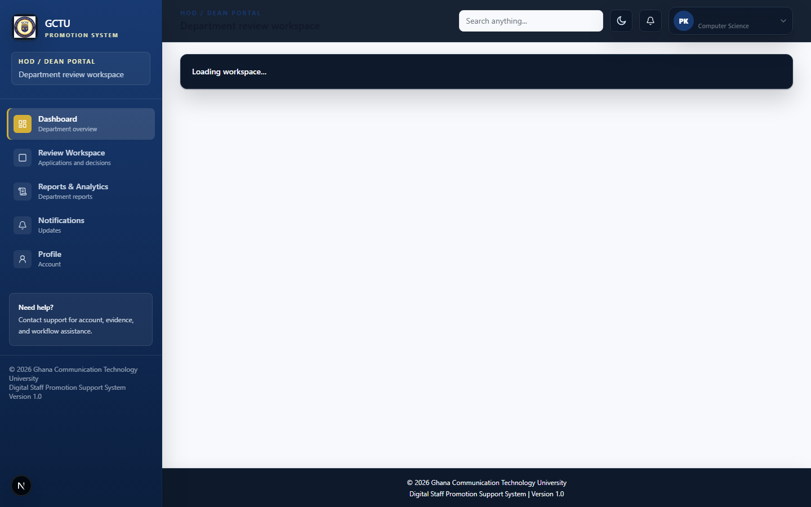

Departmental workload overview: applications pending department-level review, forwarded, or returned, scoped automatically to the signed-in reviewer's own department or faculty (§4.3, §4.7.3). The review workspace itself (not separately screenshotted here) provides search, department/faculty/rank/workflow-stage filters, date-range filtering, and sort, with a list-then-detail layout so a reviewer handling several applications from the same department can find and act on any one of them without losing their place in the queue.

### 4.12.4 HR/Admin Portal

**Figure 4.16 — HR Administrator Dashboard**


Aggregate view of active HR work, returned applications, and completed decisions — the HR Administrator's landing page after login.

**Figure 4.17 — HR Master Queue**


The full institution-wide promotion queue with segment/status/eligibility filters and per-request health indicators, implementing the "application tracking" functional requirement across every department rather than one at a time.

**Figure 4.18 — HR Verification and Eligibility Detail**

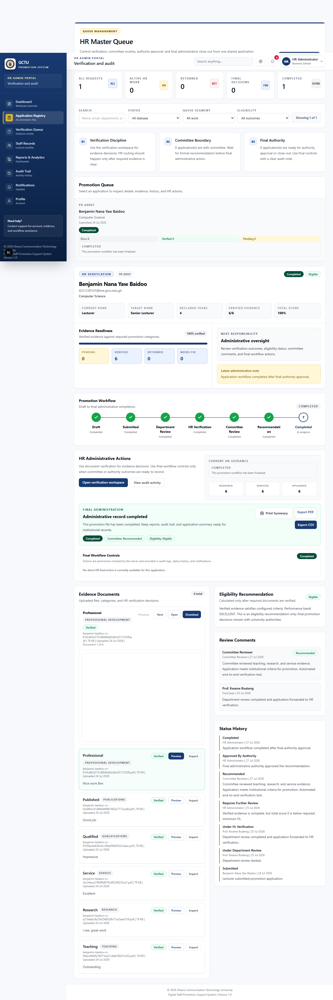

The eligibility engine's output on a fully verified application: 6/6 required evidence categories verified, a **Criteria Score of 100/100**, an **Eligible** recommendation shown as a separate status badge with its own explanatory text, complete status history from Draft through Completed, and the committee's recorded recommendation. The criteria score and the eligibility recommendation are displayed as two distinct values, consistent with the terminology set out in §4.9.1, to avoid the numeric score being read as a performance grade.

### 4.12.5 Committee Portal

**Figure 4.19 — Committee Review Queue**


Applications awaiting or having received a formal committee recommendation, implementing the review stage shown in Figure 4.10.

### 4.12.6 Reports and Analytics

**Figure 4.20 — Analytics and Reports**

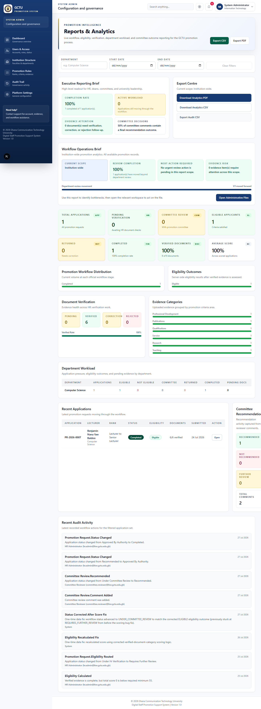

Institution-wide promotion workflow statistics, eligibility outcomes, evidence category breakdowns, and export controls (CSV/PDF). For an HOD/Dean, this same page is automatically scoped to their own department or faculty (§4.3).

### 4.12.7 System Administrator Portal

**Figure 4.21 — System Administrator Dashboard**

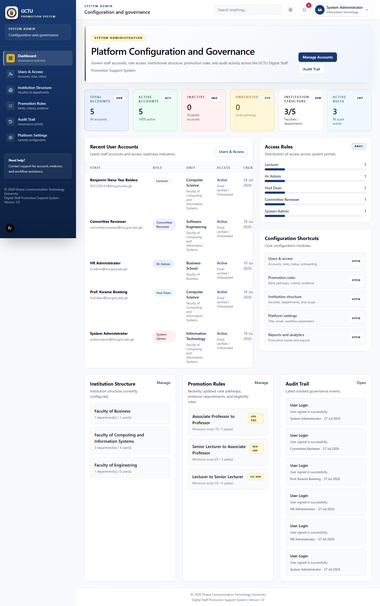

System-wide configuration and governance overview, including user/role management (§4.3 — this is where a System Administrator creates a separate HOD/Dean account per department or faculty) and audit-log access.

**Figure 4.22 — Promotion Criteria Configuration**

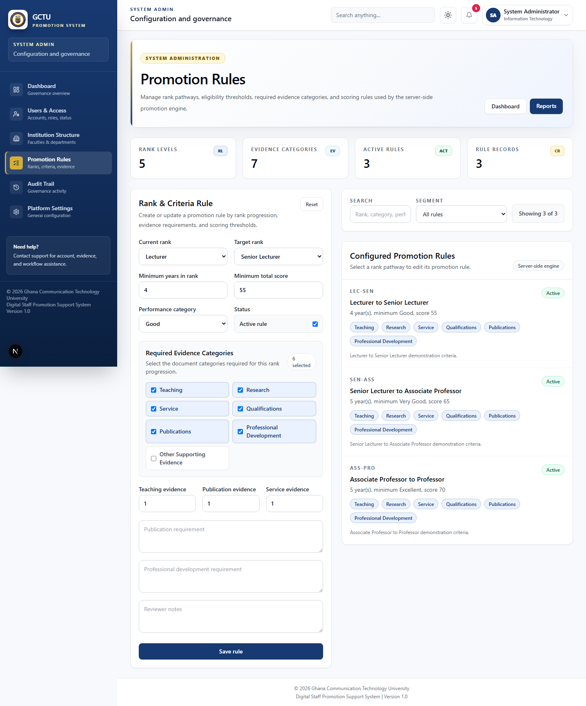

Rank-to-rank promotion criteria (minimum years in rank, required evidence categories, minimum score) configured by the System Administrator rather than hard-coded, as specified in the approved proposal's functional requirements.

### 4.12.8 Responsive Interface

**Figure 4.23 — Responsive Mobile Layout**

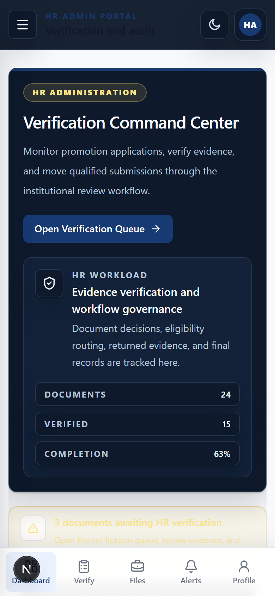

The same HR dashboard rendered at a 390px mobile viewport width, showing the sidebar collapsed into a bottom tab bar. All five portals were verified at both desktop (1440px) and mobile (390px) widths (§4.13.6); the one known limitation is that administrative list-then-detail pages stack into a single long column on narrow screens rather than a mobile-specific navigation pattern, noted in Chapter 5 as future work.

## 4.13 Testing and Evaluation

### 4.13.1 Test Environment

Testing was carried out against the actual deployed/running application (Next.js development and production builds, PostgreSQL on Neon, Chromium via Playwright for browser-driven tests) rather than through isolated unit assertions alone, at the levels described below.

### 4.13.2 Static and Build Verification

- `tsc --noEmit` — full TypeScript compilation with zero errors.
- `next build` — full production build, all routes compiled and prerendered successfully.

### 4.13.3 Database Integrity

A scripted health check (`scripts/db-health-check.js`) verifies live database connectivity, minimum required seed data (faculties, departments, promotion criteria), and that all pre-created role accounts are active, verified, and onboarded.

### 4.13.4 Functional and Integration Testing

Table 4.1 records the functional test cases exercised against the running application. Each case was executed manually through the real UI (or, where noted, via a scripted Playwright browser session) rather than assumed correct from reading the code.

**Table 4.1 — Functional and Integration Test Cases**

| ID | Module | Scenario | Preconditions | Steps | Expected Result | Actual Result | Status |
|---|---|---|---|---|---|---|---|
| TC-01 | Auth | Valid login routes to correct role dashboard | Active account exists for each of the 5 roles | Log in with each role's credentials | Redirected to that role's own dashboard | As expected | Pass |
| TC-02 | Auth | Invalid password rejected | Active account exists | Submit correct email, wrong password | 401 response, "Invalid credentials", no session cookie set | As expected | Pass |
| TC-03 | Auth | Session cookie required for protected routes | No active session | Request `/hr/dashboard` directly without logging in | Redirected to login | As expected | Pass |
| TC-04 | Account entry | Public self-registration is denied | No active session | Open `/register` and call `/api/auth/register` | Page redirects to login and API returns 403 | As expected | Pass |
| TC-05 | Staff provisioning | HRODD creates a neutral staff account | Verified staff identity and official email available | Provision the staff record and applicant access | Staff record and single-use activation invitation created | As expected | Pass |
| TC-06 | Account activation | Single-use activation link enables login | HRODD-provisioned inactive account | Open the valid activation link and set a password | Token is consumed, official email is verified, and login is enabled | As expected | Pass |
| TC-07 | Applicant application | Route-bound draft created | Verified active staff account with applicant access | Select an available policy route and start application | `PromotionRequest` created as `DRAFT` and linked to the frozen route version | As expected | Pass |
| TC-08 | Evidence upload | Valid PDF accepted | Draft application exists | Upload a PDF under the Teaching category | Document stored, category status updates to "uploaded" | As expected | Pass |
| TC-09 | Evidence upload | Non-PDF file rejected | Draft application exists | Attempt to upload a `.docx` file | Upload rejected client-side with "Please choose a PDF file" | As expected | Pass |
| TC-10 | Evidence upload | Oversized file rejected | Draft application exists | Attempt to upload a PDF larger than 10MB | Upload rejected with a clear size-limit error | As expected | Pass |
| TC-11 | Evidence upload UX | Upload panel reachable below desktop width | Draft application exists, viewport < 1280px | Select a category on a narrow viewport | Upload panel auto-scrolls into view | As expected (fixed during this study — see Chapter 4 note below) | Pass |
| TC-12 | Submission | Submission blocked until required categories present | Draft application, required categories incomplete | Attempt to submit | Submission blocked or flagged incomplete | As expected | Pass |
| TC-13 | Submission | Valid submission transitions status and routes correctly | All required categories uploaded | Submit the application | Status becomes `SUBMITTED`/`UNDER_DEPARTMENT_REVIEW`; correct HOD notified (§4.7.6) | As expected | Pass |
| TC-14 | Routing | Submission reaches the HOD/Dean of the applicant's own department | Two HOD/Dean accounts exist, each scoped to a different department; lecturer belongs to Department A | Submit an application as a Department A lecturer | Only the Department A HOD/Dean (and System Admins) receive the review notification, not the Department B HOD/Dean | As expected | Pass |
| TC-15 | Routing fallback | Submission still reaches a reviewer when no department-level HOD exists | Lecturer's department has no HOD assigned, but a Dean is assigned to its faculty | Submit an application | Faculty Dean (and System Admins) receive the review notification | As expected | Pass |
| TC-16 | HOD/Dean review | Department-scoped queue excludes other departments | Applications exist in multiple departments | Log in as a department-scoped HOD | Queue shows only that department's applications | As expected | Pass |
| TC-17 | HOD/Dean review | Return for correction | Application `SUBMITTED` | HOD returns the application with a comment | Status becomes `RETURNED_FOR_CORRECTION`; lecturer notified | As expected | Pass |
| TC-18 | HOD/Dean review | Forward to HR | Application `SUBMITTED`, evidence academically complete | HOD forwards the application | Status becomes `UNDER_HR_VERIFICATION` | As expected | Pass |
| TC-19 | HR verification | Document verified individually | Application under HR verification | HR marks a document `VERIFIED` | `Document.verificationStatus` updates; `Verification` row inserted | As expected | Pass |
| TC-20 | HR verification | Document rejected returns application | Application under HR verification | HR rejects a required document | Status becomes `RETURNED_FOR_CORRECTION`; lecturer notified with reason | As expected | Pass |
| TC-21 | Eligibility engine | Score of 0 on unverified application (regression test for the corrected defect) | Application with no verified documents | Trigger eligibility calculation | Criteria score is 0 and status is not `ELIGIBLE` (was previously always 0 regardless of verification — §4.9.2) | As expected after fix | Pass |
| TC-22 | Eligibility engine | Correct score on fully verified application | All required categories verified | Trigger eligibility calculation | Criteria score 100/100, status `ELIGIBLE`, routed to committee | As expected | Pass |
| TC-23 | Eligibility engine | Below-threshold score does not route to committee | Some but not all required categories verified, or score below configured minimum | Trigger eligibility calculation | Status `REQUIRES_FURTHER_REVIEW` or `NOT_ELIGIBLE`, not routed to committee | As expected | Pass |
| TC-24 | Committee review | Recommendation recorded only while under committee review | Application status not `UNDER_COMMITTEE_REVIEW` | Attempt to submit a committee recommendation | Rejected with a 409 workflow error | As expected | Pass |
| TC-25 | Committee review | Valid recommendation transitions status | Application `UNDER_COMMITTEE_REVIEW` | Submit a `RECOMMENDED` decision with comment | Status becomes `RECOMMENDED`; `ReviewComment`, `StatusHistory`, `AuditLog` all written | As expected | Pass |
| TC-26 | Final decision | HR records authority approval | Application `RECOMMENDED` | HR clicks "Record authority approval" (confirmation dialog) | Status becomes `APPROVED_BY_AUTHORITY` | As expected | Pass |
| TC-27 | Final decision | HR completes workflow | Application `APPROVED_BY_AUTHORITY` | HR clicks "Complete workflow" (confirmation dialog) | Status becomes `COMPLETED`; lecturer notified of final outcome | As expected | Pass |
| TC-28 | Audit trail | Full status history recorded in order | Application taken through the entire lifecycle | Inspect Status History panel after completion | Draft → Submitted → Department Review → HR Verification → Recommended → Approved by Authority → Completed, each with actor and timestamp | As expected | Pass |
| TC-29 | Access control | Role-restricted action rejected server-side | Logged in as Lecturer | Attempt to call the committee-review API directly | 403/permission error, independent of what the client UI shows | As expected | Pass |
| TC-30 | Access control | Cross-department access blocked | Two department-scoped HOD accounts | HOD for Department A attempts to open a Department B application by guessing its URL | Access denied by `canAccessDepartmentPromotionRequest` (§4.8) | As expected | Pass |
| TC-31 | Criteria configuration | System Admin changes required categories | System Admin account | Update required evidence categories for a rank transition | New criteria applied to subsequent eligibility calculations without a code deployment | As expected | Pass |
| TC-32 | User management | System Admin creates a department-scoped HOD account | System Admin account, target department exists | Create a user with role `HOD_DEAN` and assign a department | Account created with `departmentId` set; subsequently receives only that department's review notifications (TC-14) | As expected | Pass |
| TC-33 | Reporting | CSV export reflects current filtered data | Applications exist across multiple statuses | Apply a status filter on Analytics, export CSV | Exported rows match the filtered view | As expected | Pass |
| TC-34 | File naming | Downloaded evidence uses a readable filename | A document has been uploaded | Download an evidence file from HR or the lecturer portal | Filename is derived from the document title (e.g. `research-publication-2024.pdf`), not the internal hashed storage name | As expected (fixed during this study) | Pass |
| TC-35 | Notifications | Next responsible role notified on status change | Application transitions status | Observe notifications after a transition | Lecturer and the next responsible role(s) receive an in-app notification | As expected | Pass |
| TC-36 | Responsiveness | No horizontal overflow on any role dashboard | — | Load each of the 5 role dashboards at 1440px and 390px viewports | No horizontal scrollbar or broken layout at either width | As expected | Pass |

### 4.13.5 End-to-End Workflow Testing

In addition to the individual functional cases in Table 4.1, the complete promotion pipeline was exercised in a single continuous session in a real, headless-browser session (Chromium, driven via Playwright) against the running application:

1. **HR verification** — logged in as HR Administrator, opened a real application record, confirmed all six required evidence documents (Teaching, Research, Service, Qualifications, Publications, Professional Development) as verified.
2. **Eligibility calculation** — confirmed the engine computed a `Criteria Score: 100/100` and an `Eligible` recommendation, and that the application status advanced to `UNDER_COMMITTEE_REVIEW`.
3. **Committee recommendation** — logged in as Committee Reviewer, located the application in the review queue (score visible in the queue list), submitted a `RECOMMENDED` decision through the actual review form, and confirmed the resulting workflow-history and audit-log entries.
4. **HR final decision** — logged back in as HR Administrator, used "Record authority approval" and "Complete workflow" (each behind a confirmation dialog) to move the application to `APPROVED_BY_AUTHORITY` and then `COMPLETED`.
5. **Status history verification** — confirmed the full audit trail was correct and in order end to end: Draft → Submitted → Department Review → HR Verification → Recommended → Approved by Authority → Completed.

This test is what surfaced the scoring defect described in §4.9.2 (TC-21 in Table 4.1 is the regression test written after the fix) — the application appeared correct when the eligibility rules were read in isolation, but produced a wrong result (a criteria score of 0 regardless of verified evidence) once actually exercised through the full workflow, which is the justification for testing the running system rather than relying on code review alone.

### 4.13.6 Access Control and Responsiveness Testing

- Verified that role-restricted actions (e.g. committee recommendation submission) are rejected server-side when attempted outside the correct workflow state, independent of what the client UI shows (TC-29).
- Verified that department-scoped HOD/Dean accounts cannot access another department's applications even via direct URL access (TC-30).
- Verified layout at both a 1440px desktop viewport and a 390px mobile viewport across all five role dashboards; confirmed no horizontal overflow or broken layout on any page at either width (TC-36).

### 4.13.7 Usability / User Acceptance Testing

Chapter Three (§3.19) proposed that user acceptance testing would be carried out with selected representative users. As of this chapter, that formal exercise had not yet been run against the current build, and is recorded here as an open item rather than presented as complete. The intended method — a short task-based script covering application submission, department review, HR verification, and committee recommendation, followed by a brief structured feedback form for each participating role — was prepared for this purpose (Appendix, UAT materials) and is ready to run with representative staff before final submission. This is carried forward explicitly as a limitation in Chapter 5 (§5.6) rather than claimed as completed testing that did not actually take place.

### 4.13.8 Defects Found and Corrective Actions

| Defect | How it was found | Correction | Verified by |
|---|---|---|---|
| Eligibility engine always computed a criteria score of 0, regardless of verified evidence (§4.9.2) | End-to-end workflow testing (§4.13.5), not visible from static code review | Score computation changed to read verified document categories directly instead of an always-empty `Score` relation | TC-21, TC-22 |
| Downloaded/displayed evidence filenames exposed an internal random hash rather than a readable name | Manual UI review during this study | Server-side `Content-Disposition` and UI download links now derive a readable filename from the document title | TC-34 |
| Login and lecturer-creation endpoints logged raw user-identifying input (`console.log`) on every request | Manual code review during this study | Debug logging removed from both endpoints | Manual re-test of login and lecturer creation, no behavioural change |
| Evidence-upload panel required manual scrolling to locate below the desktop breakpoint | Manual UI review during this study | Category selection now auto-scrolls the upload panel into view below 1280px viewport width | TC-11 |

## 4.14 Deployment

The system is deployed as follows:

- **Hosting**: Vercel, building the Next.js application directly from the Git repository.
- **Database**: Neon serverless PostgreSQL, connected via `DATABASE_URL`; the production Prisma schema (`schema.postgres.prisma`) is generated and migrated with `prisma migrate deploy` as part of the deployment script (`deploy:prod`).
- **Domain**: `promotion.techdalt.com`, a Cloudflare-managed subdomain pointed at Vercel via CNAME, kept separate from the existing apex domain's DNS records.
- **Email**: Resend, for transactional account-verification email, using a verified sending domain.
- **Environment configuration**: `AUTH_SECRET`, `DATABASE_URL`, `APP_URL`/`NEXT_PUBLIC_APP_URL`, and `EMAIL_*` variables are set in the Vercel project rather than committed to source control.
- **Health check**: a public `/api/health` endpoint reports application and database connectivity for post-deploy verification.

**Figure 4.24 — Deployment Diagram**

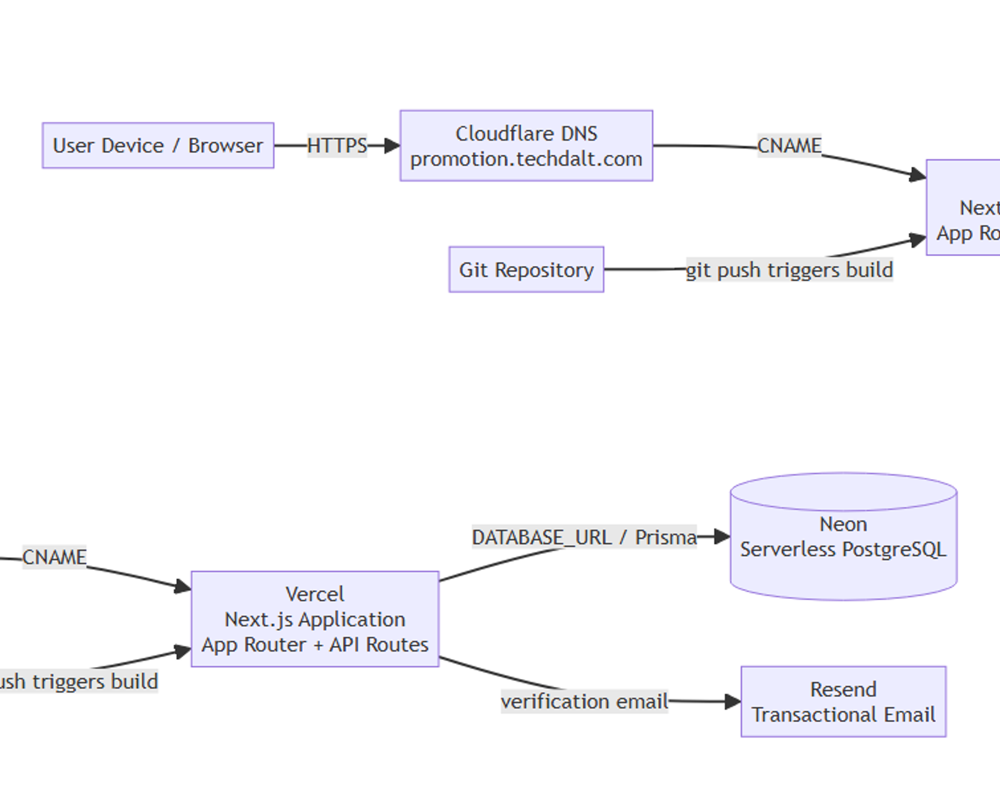

<details>
<summary>Diagram source (Mermaid)</summary>

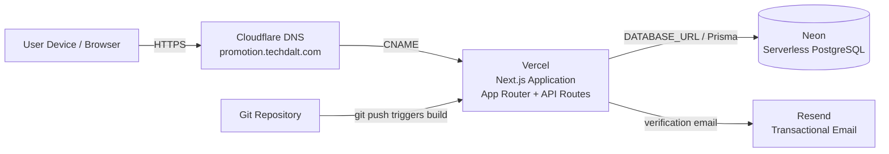
```mermaid
flowchart LR
    Browser["User Device / Browser"]
    Cloudflare["Cloudflare DNS\npromotion.techdalt.com"]
    Vercel["Vercel\nNext.js Application\nApp Router + API Routes"]
    Neon[("Neon\nServerless PostgreSQL")]
    Resend["Resend\nTransactional Email"]
    Git["Git Repository"]

    Browser -- HTTPS --> Cloudflare
    Cloudflare -- CNAME --> Vercel
    Vercel -- "DATABASE_URL / Prisma" --> Neon
    Vercel -- "verification email" --> Resend
    Git -- "git push triggers build" --> Vercel
```

</details>

## 4.15 Chapter Summary

This chapter presented the implemented architecture at both the layer level (§4.2) and the component level (§4.3), the database schema (§4.4), the workflow state design (§4.5), the use case model (§4.6), activity and sequence models covering every major cross-role process (§4.7), role-based access control (§4.8), the eligibility decision-support engine including a defect found and corrected while testing the live system (§4.9), the system's modular structure and technology stack (§4.10–§4.11), its user interface across five role-specific portals (§4.12), formal functional test cases and the defects they surfaced (§4.13), and its production deployment configuration (§4.14). The next chapter summarises the study, answers the research questions, evaluates it against the objectives set out in Chapter 1, and presents conclusions, recommendations, and suggestions for future work.
