# All Ready-to-Use Mermaid Diagrams

## Figure 4 / Chapter Figure 4.1 - System Architecture

```mermaid
%%{init: {"theme":"base","themeVariables":{"fontFamily":"Arial","primaryColor":"#F8FAFC","primaryTextColor":"#0F172A","primaryBorderColor":"#334155","lineColor":"#334155","secondaryColor":"#EEF2FF","tertiaryColor":"#ECFDF5","clusterBkg":"#FFFFFF","clusterBorder":"#CBD5E1"},"flowchart":{"htmlLabels":true,"curve":"basis"}}}%%
%% Figure 4 / Chapter Figure 4.1 - System Architecture
flowchart LR
    Browser["User Device / Browser"]:::client

    subgraph Presentation["Presentation Layer"]
        direction TB
        UI["Role-specific React portals<br/>Lecturer, HOD/Dean, HR, Committee, System Admin"]:::ui
        Shell["Responsive application shell<br/>Desktop sidebar and mobile bottom tabs"]:::ui
        UI --> Shell
    end

    subgraph Application["Application Layer - Next.js Server"]
        direction TB
        MW["Middleware<br/>Session validation and route protection"]:::logic
        API["API routes<br/>Authentication, applications, evidence, verification, review, reports, admin"]:::logic
        Domain["Domain services<br/>Workflow, RBAC, department scope, eligibility, audit, notification"]:::logic
        MW --> API --> Domain
    end

    subgraph Data["Data Layer"]
        direction TB
        Prisma["Prisma ORM<br/>Typed data access and migrations"]:::data
        DB[("Neon PostgreSQL<br/>Users, requests, documents, criteria, audit logs")]:::store
        Blob[("document_file_blobs<br/>Durable PDF evidence storage")]:::store
        Prisma --> DB
        Prisma --> Blob
    end

    Browser -->|HTTPS| UI
    Shell -->|protected requests| MW
    Domain --> Prisma
    Prisma -->|records and status updates| Domain
    API -->|JSON responses| Shell

    classDef client fill:#FFFFFF,stroke:#111827,stroke-width:1.6px,color:#111827;
    classDef ui fill:#EFF6FF,stroke:#1D4ED8,stroke-width:1.4px,color:#0F172A;
    classDef logic fill:#ECFDF5,stroke:#047857,stroke-width:1.4px,color:#0F172A;
    classDef data fill:#F8FAFC,stroke:#334155,stroke-width:1.4px,color:#0F172A;
    classDef store fill:#FEFCE8,stroke:#A16207,stroke-width:1.4px,color:#0F172A;
```

## Figure 5 / Chapter Figure 4.2 - Component Diagram

```mermaid
%%{init: {"theme":"base","themeVariables":{"fontFamily":"Arial","primaryColor":"#F8FAFC","primaryTextColor":"#0F172A","primaryBorderColor":"#334155","lineColor":"#334155","secondaryColor":"#EEF2FF","tertiaryColor":"#ECFDF5","clusterBkg":"#FFFFFF","clusterBorder":"#CBD5E1"},"flowchart":{"htmlLabels":true,"curve":"basis"}}}%%
%% Figure 5 / Chapter Figure 4.2 - Component Diagram
flowchart TB
    subgraph Portals["Role-specific Portals"]
        direction LR
        LecturerPortal["Lecturer Portal"]:::portal
        HodPortal["HOD/Dean Portal"]:::portal
        HrPortal["HR Portal"]:::portal
        CommitteePortal["Committee Portal"]:::portal
        AdminPortal["System Admin Portal"]:::portal
    end

    subgraph Core["Core Domain Modules"]
        direction TB
        Auth["Authentication Module"]:::core
        RBAC["RBAC Module"]:::core
        Workflow["Promotion Workflow Module"]:::core
        Scope["Department Scope Module"]:::core
        Upload["Evidence Upload Module"]:::core
        Verify["Verification Module"]:::core
        Eligibility["Eligibility Engine"]:::core
        Review["Committee Review Module"]:::core
        Criteria["Criteria Configuration Module"]:::core
        Reports["Reporting and Analytics Module"]:::core
        Audit["Audit Logging Module"]:::core
        Notify["Notification Module"]:::core
    end

    subgraph DataAccess["Data Access and External Services"]
        direction LR
        Prisma["Prisma ORM"]:::data
        DB[("Neon PostgreSQL")]:::store
        Blob[("document_file_blobs")]:::store
        Email["Resend Email"]:::external
    end

    LecturerPortal --> Auth
    LecturerPortal --> Upload
    LecturerPortal --> Workflow
    HodPortal --> Auth
    HodPortal --> Scope
    HodPortal --> Workflow
    HrPortal --> Auth
    HrPortal --> Verify
    HrPortal --> Eligibility
    HrPortal --> Reports
    CommitteePortal --> Auth
    CommitteePortal --> Review
    AdminPortal --> Auth
    AdminPortal --> RBAC
    AdminPortal --> Criteria
    AdminPortal --> Reports

    Auth --> RBAC
    Workflow --> Scope
    Workflow --> Audit
    Workflow --> Notify
    Upload --> Prisma
    Upload --> Blob
    Verify --> Prisma
    Eligibility --> Prisma
    Review --> Prisma
    Criteria --> Prisma
    Reports --> Prisma
    Audit --> Prisma
    Notify --> Prisma
    Notify -. verification and workflow email .-> Email
    Prisma --> DB

    classDef portal fill:#EFF6FF,stroke:#1D4ED8,stroke-width:1.4px,color:#0F172A;
    classDef core fill:#ECFDF5,stroke:#047857,stroke-width:1.4px,color:#0F172A;
    classDef data fill:#F8FAFC,stroke:#334155,stroke-width:1.4px,color:#0F172A;
    classDef store fill:#FEFCE8,stroke:#A16207,stroke-width:1.4px,color:#0F172A;
    classDef external fill:#FDF2F8,stroke:#BE185D,stroke-width:1.4px,color:#0F172A;
```

## Figure 6 / Chapter Figure 4.3 - Entity Relationship Diagram

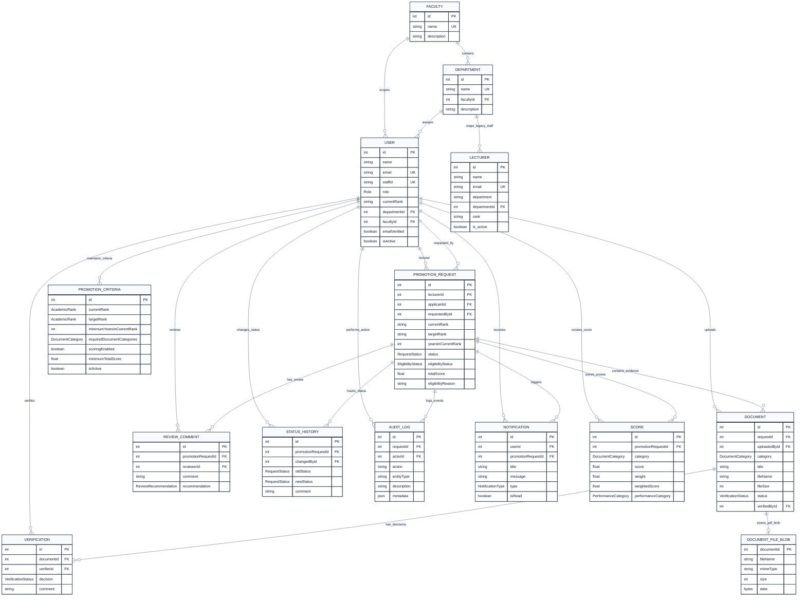

## Figure 7 / Chapter Figure 4.4 - Promotion Workflow State Diagram

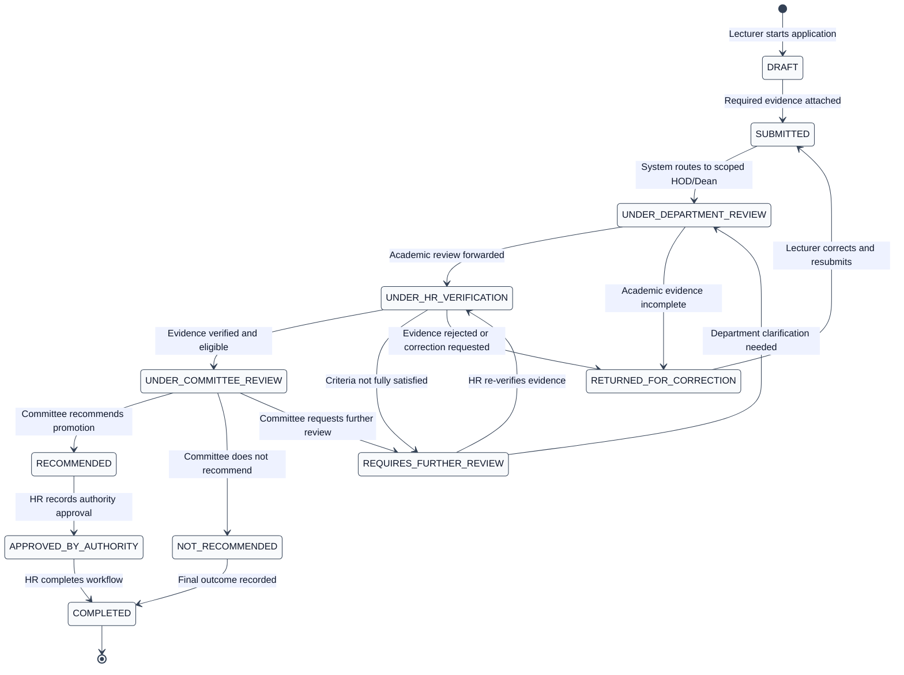

## Figure 8 / Chapter Figure 4.5 - Use Case Diagram

```mermaid
%%{init: {"theme":"base","themeVariables":{"fontFamily":"Arial","primaryColor":"#F8FAFC","primaryTextColor":"#0F172A","primaryBorderColor":"#334155","lineColor":"#334155","secondaryColor":"#EEF2FF","tertiaryColor":"#ECFDF5","clusterBkg":"#FFFFFF","clusterBorder":"#CBD5E1"},"flowchart":{"htmlLabels":true,"curve":"basis"}}}%%
%% Figure 8 / Chapter Figure 4.5 - Use Case Diagram
flowchart TB
    subgraph Actors["External Actors"]
        direction LR
        Lecturer["Lecturer"]:::actor
        HodDean["HOD / Dean"]:::actor
        HR["HR Administrator"]:::actor
        Committee["Committee Reviewer"]:::actor
        Admin["System Administrator"]:::actor
    end

    subgraph System["Digital Staff Promotion Support System"]
        direction TB
        subgraph LecturerCases["Lecturer Functions"]
            direction LR
            UC1([Create promotion request]):::usecase
            UC2([Upload categorized PDF evidence]):::usecase
            UC3([Track application status and outcome]):::usecase
        end
        subgraph AcademicCases["Academic Review Functions"]
            direction LR
            UC4([Review departmental application]):::usecase
            UC5([Return, request review, or forward to HR]):::usecase
        end
        subgraph HrCases["HR and Decision-Support Functions"]
            direction LR
            UC6([Verify evidence documents]):::usecase
            UC7([Run eligibility recommendation]):::usecase
            UC8([Record authority approval and close workflow]):::usecase
            UC9([Generate workflow reports]):::usecase
        end
        subgraph CommitteeCases["Committee Functions"]
            direction LR
            UC10([Review eligible application]):::usecase
            UC11([Record committee recommendation]):::usecase
        end
        subgraph AdminCases["Administration and Governance Functions"]
            direction LR
            UC12([Manage users, roles, faculties, and departments]):::usecase
            UC13([Configure promotion criteria]):::usecase
            UC14([View audit logs and governance records]):::usecase
        end
    end

    Lecturer --> UC1
    Lecturer --> UC2
    Lecturer --> UC3
    HodDean --> UC4
    HodDean --> UC5
    HR --> UC6
    HR --> UC7
    HR --> UC8
    HR --> UC9
    Committee --> UC10
    Committee --> UC11
    Admin --> UC12
    Admin --> UC13
    Admin --> UC14
    Admin --> UC9
    UC6 -. verified documents .-> UC7
    UC7 -. eligible application .-> UC10
    UC11 -. recommendation .-> UC8

    classDef actor fill:#FFFFFF,stroke:#111827,stroke-width:1.8px,color:#111827;
    classDef usecase fill:#EEF2FF,stroke:#4338CA,stroke-width:1.5px,color:#111827;
```

## Figure 9 / Chapter Figure 4.6 - Overall Promotion Process Activity Diagram

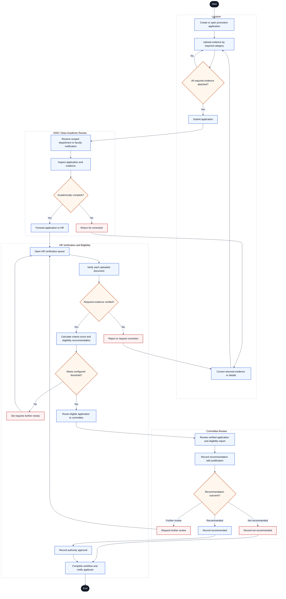

## Figure 10 / Chapter Figure 4.7 - Lecturer Application Activity Diagram

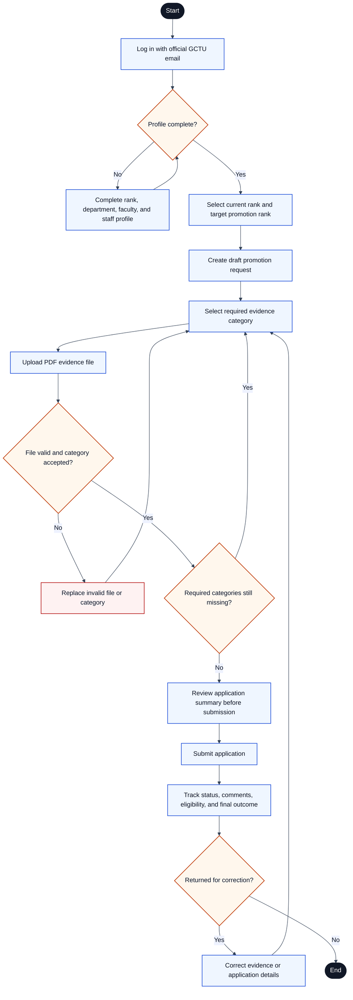

## Figure 11 / Chapter Figure 4.8 - HOD/Dean Review Activity Diagram

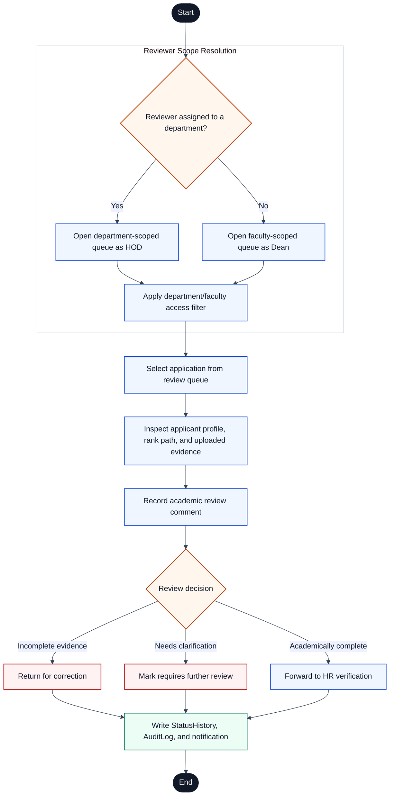

## Figure 12 / Chapter Figure 4.9 - HR Verification and Eligibility Activity Diagram

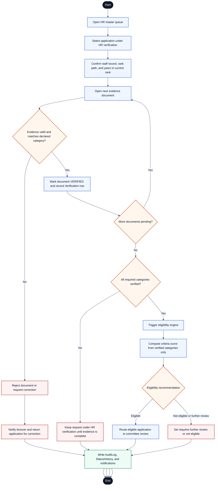

## Figure 13 / Chapter Figure 4.10 - Committee Review Activity Diagram

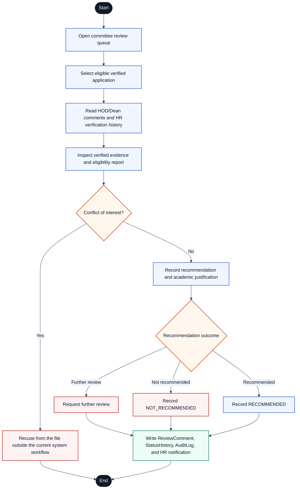

## Figure 14 / Chapter Figure 4.11 - Application Submission and Routing Sequence Diagram

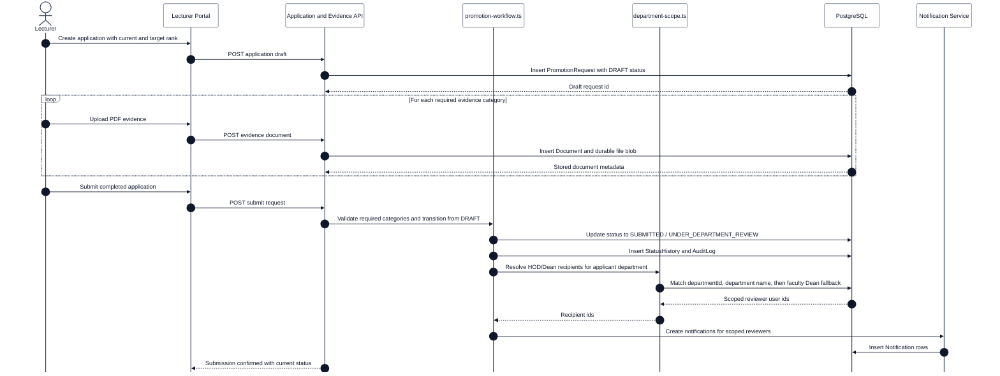

## Figure 15 / Chapter Figure 4.12 - Eligibility Calculation Sequence Diagram

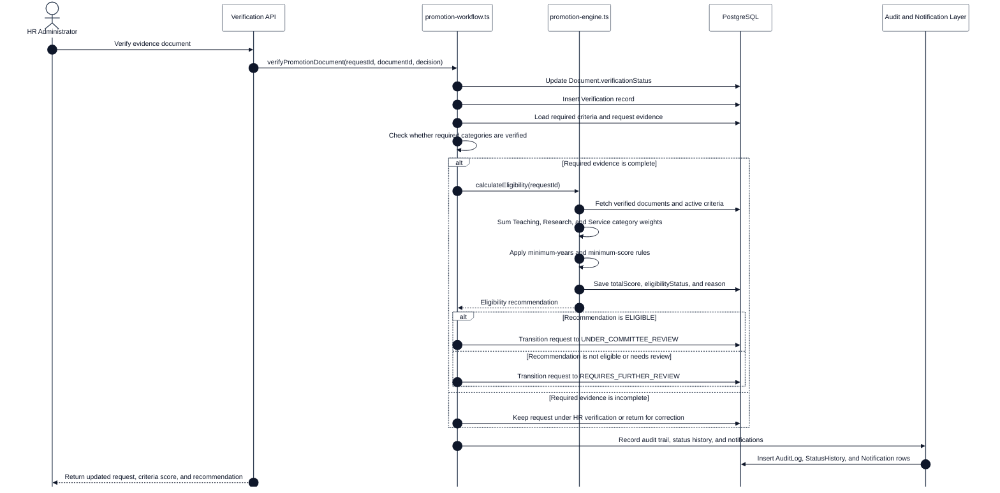

## Figure 16 / Chapter Figure 4.13 - Committee Recommendation and Final Recording Sequence Diagram

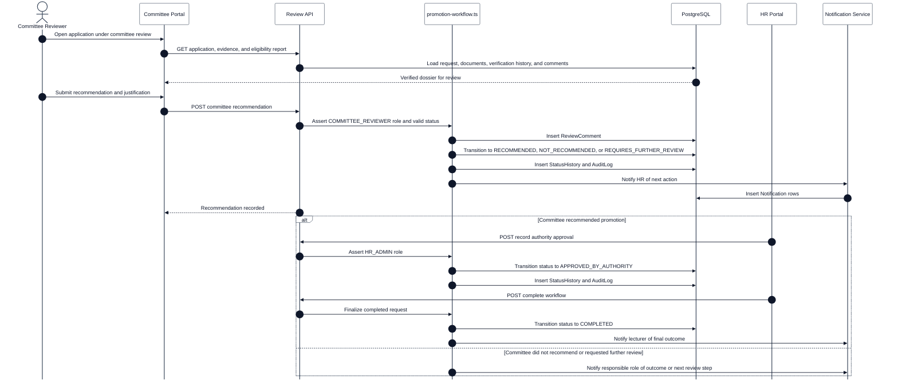

## Figure 27 / Chapter Figure 4.24 - Deployment Diagram

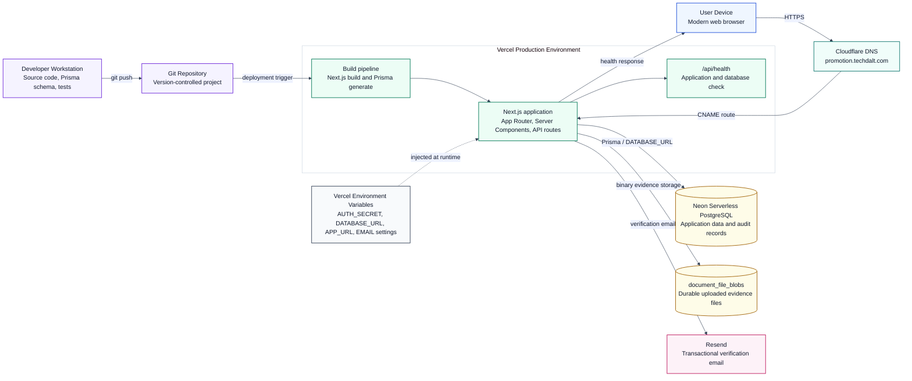
